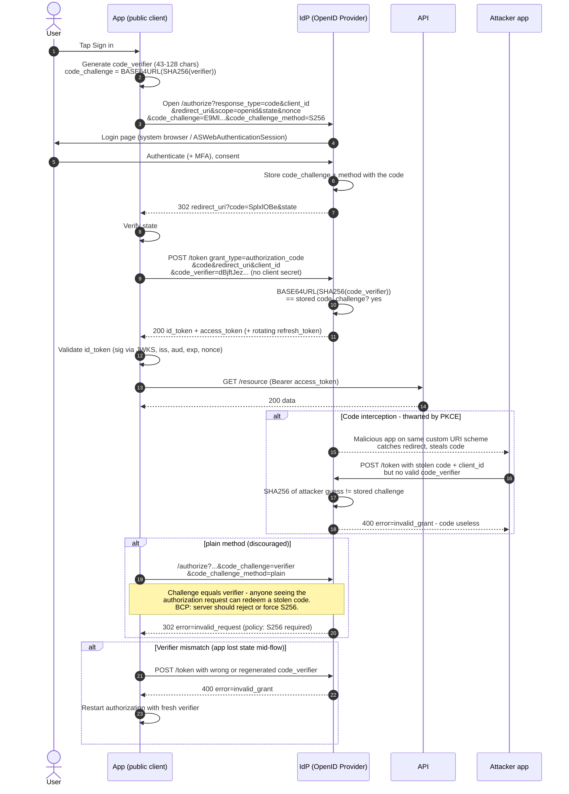

# Authorization Code + PKCE — Sequence Diagram

Happy path first; then the interception attack shown as thwarted, the plain-method
variant, and a verifier mismatch.

```mermaid
sequenceDiagram
    autonumber
    actor User
    participant App as App (public client)
    participant IdP as IdP (OpenID Provider)
    participant API
    participant Atk as Attacker app

    User->>App: Tap Sign in
    App->>App: Generate code_verifier (43-128 chars)<br/>code_challenge = BASE64URL(SHA256(verifier))
    App->>IdP: Open /authorize?response_type=code&client_id<br/>&redirect_uri&scope=openid&state&nonce<br/>&code_challenge=E9Ml...&code_challenge_method=S256
    IdP->>User: Login page (system browser / ASWebAuthenticationSession)
    User->>IdP: Authenticate (+ MFA), consent
    IdP->>IdP: Store code_challenge + method with the code
    IdP-->>App: 302 redirect_uri?code=SplxlOBe&state
    App->>App: Verify state
    App->>IdP: POST /token grant_type=authorization_code<br/>&code&redirect_uri&client_id<br/>&code_verifier=dBjftJez... (no client secret)
    IdP->>IdP: BASE64URL(SHA256(code_verifier))<br/>== stored code_challenge? yes
    IdP-->>App: 200 id_token + access_token (+ rotating refresh_token)
    App->>App: Validate id_token (sig via JWKS, iss, aud, exp, nonce)
    App->>API: GET /resource (Bearer access_token)
    API-->>App: 200 data

    alt Code interception - thwarted by PKCE
        IdP-->>Atk: Malicious app on same custom URI scheme<br/>catches redirect, steals code
        Atk->>IdP: POST /token with stolen code + client_id<br/>but no valid code_verifier
        IdP->>IdP: SHA256 of attacker guess != stored challenge
        IdP-->>Atk: 400 error=invalid_grant - code useless
    end

    alt plain method (discouraged)
        App->>IdP: /authorize?...&code_challenge=verifier<br/>&code_challenge_method=plain
        Note over App,IdP: Challenge equals verifier - anyone seeing the<br/>authorization request can redeem a stolen code.<br/>BCP: server should reject or force S256.
        IdP-->>App: 302 error=invalid_request (policy: S256 required)
    end

    alt Verifier mismatch (app lost state mid-flow)
        App->>IdP: POST /token with wrong or regenerated code_verifier
        IdP-->>App: 400 error=invalid_grant
        App->>App: Restart authorization with fresh verifier
    end
```
