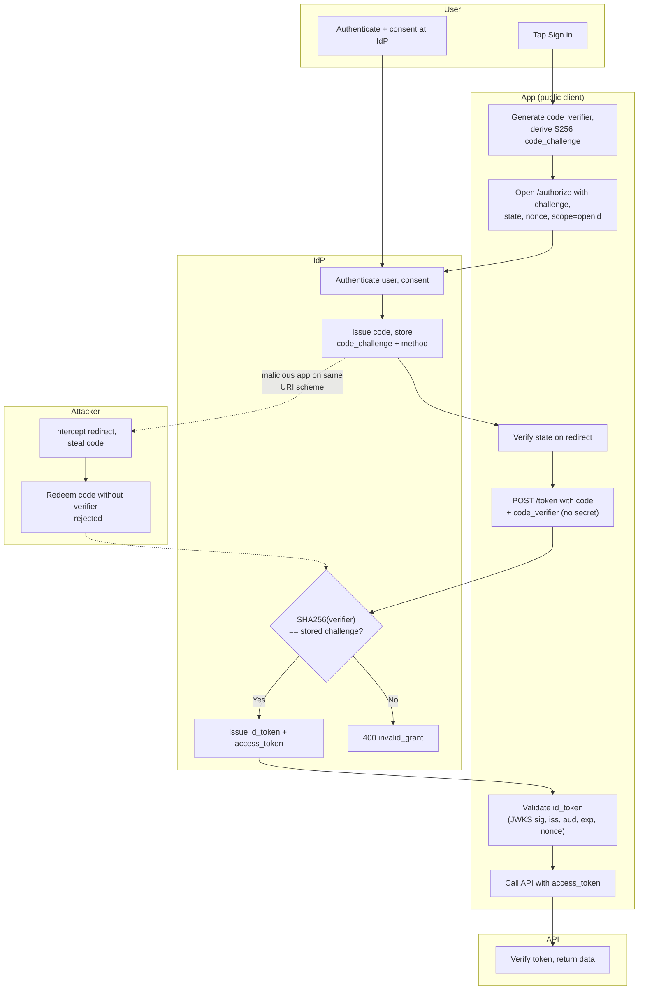

# Authorization Code + PKCE — Swimlane

The App lane covers the public client (SPA or native app); the interception branch shows
where PKCE breaks the attack.

```mermaid
flowchart TD
    subgraph User
        U1[Tap Sign in]
        U2[Authenticate + consent at IdP]
    end

    subgraph App["App (public client)"]
        A1["Generate code_verifier,<br/>derive S256 code_challenge"]
        A2["Open /authorize with challenge,<br/>state, nonce, scope=openid"]
        A3[Verify state on redirect]
        A4["POST /token with code<br/>+ code_verifier (no secret)"]
        A5["Validate id_token<br/>(JWKS sig, iss, aud, exp, nonce)"]
        A6["Call API with access_token"]
    end

    subgraph IdP
        I1[Authenticate user, consent]
        I2["Issue code, store<br/>code_challenge + method"]
        I3{"SHA256(verifier)<br/>== stored challenge?"}
        I4[Issue id_token + access_token]
        I5["400 invalid_grant"]
    end

    subgraph API
        P1["Verify token, return data"]
    end

    subgraph Attacker
        X1["Intercept redirect,<br/>steal code"]
        X2["Redeem code without verifier<br/>- rejected"]
    end

    U1 --> A1 --> A2 --> I1
    U2 --> I1 --> I2 --> A3 --> A4 --> I3
    I3 -->|Yes| I4 --> A5 --> A6 --> P1
    I3 -->|No| I5
    I2 -.->|"malicious app on same<br/>URI scheme"| X1 --> X2 -.-> I3
```
