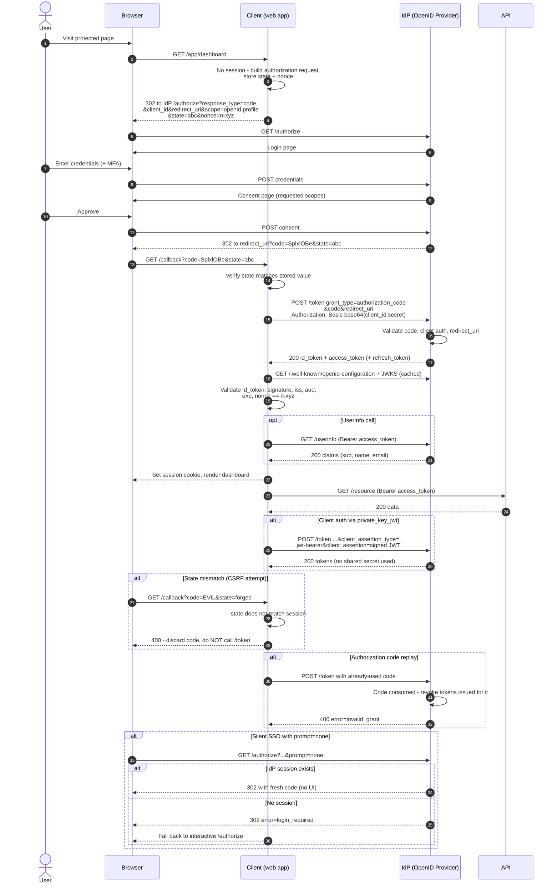

# Authorization Code Flow — Sequence Diagram

Happy path first, then client-authentication variant, state mismatch, code replay,
and `prompt=none` SSO alternates.

```mermaid
sequenceDiagram
    autonumber
    actor User
    participant Browser
    participant Client as Client (web app)
    participant IdP as IdP (OpenID Provider)
    participant API

    User->>Browser: Visit protected page
    Browser->>Client: GET /app/dashboard
    Client->>Client: No session - build authorization request,<br/>store state + nonce
    Client-->>Browser: 302 to IdP /authorize?response_type=code<br/>&client_id&redirect_uri&scope=openid profile<br/>&state=abc&nonce=n-xyz
    Browser->>IdP: GET /authorize
    IdP->>Browser: Login page
    User->>Browser: Enter credentials (+ MFA)
    Browser->>IdP: POST credentials
    IdP->>Browser: Consent page (requested scopes)
    User->>Browser: Approve
    Browser->>IdP: POST consent
    IdP-->>Browser: 302 to redirect_uri?code=SplxlOBe&state=abc
    Browser->>Client: GET /callback?code=SplxlOBe&state=abc
    Client->>Client: Verify state matches stored value

    Client->>IdP: POST /token grant_type=authorization_code<br/>&code&redirect_uri<br/>Authorization: Basic base64(client_id:secret)
    IdP->>IdP: Validate code, client auth, redirect_uri
    IdP-->>Client: 200 id_token + access_token (+ refresh_token)
    Client->>IdP: GET /.well-known/openid-configuration + JWKS (cached)
    Client->>Client: Validate id_token: signature, iss, aud,<br/>exp, nonce == n-xyz

    opt UserInfo call
        Client->>IdP: GET /userinfo (Bearer access_token)
        IdP-->>Client: 200 claims (sub, name, email)
    end

    Client-->>Browser: Set session cookie, render dashboard
    Client->>API: GET /resource (Bearer access_token)
    API-->>Client: 200 data

    alt Client auth via private_key_jwt
        Client->>IdP: POST /token ...&client_assertion_type=<br/>jwt-bearer&client_assertion=signed JWT
        IdP-->>Client: 200 tokens (no shared secret used)
    end

    alt State mismatch (CSRF attempt)
        Browser->>Client: GET /callback?code=EVIL&state=forged
        Client->>Client: state does not match session
        Client-->>Browser: 400 - discard code, do NOT call /token
    end

    alt Authorization code replay
        Client->>IdP: POST /token with already-used code
        IdP->>IdP: Code consumed - revoke tokens issued for it
        IdP-->>Client: 400 error=invalid_grant
    end

    alt Silent SSO with prompt=none
        Browser->>IdP: GET /authorize?...&prompt=none
        alt IdP session exists
            IdP-->>Browser: 302 with fresh code (no UI)
        else No session
            IdP-->>Browser: 302 error=login_required
            Client-->>Browser: Fall back to interactive /authorize
        end
    end
```
