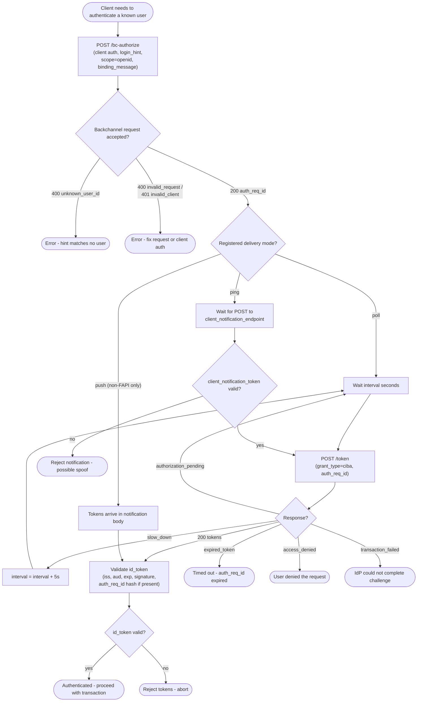

# CIBA — Decision Flowchart

Client-side decision logic across the three token delivery modes, with explicit
error terminals for every CIBA error code.

Notes

- Ping mode still requires a `/token` call; only push mode delivers tokens directly,
  which is why FAPI-CIBA forbids it.
- On `expired_token` the client may retry with a fresh `/bc-authorize`, but should
  rate-limit to avoid push-bombing the user.

Related: [README](./README.md) | [Sequence](./sequence.md) | [Swimlane](./swimlane.md)
