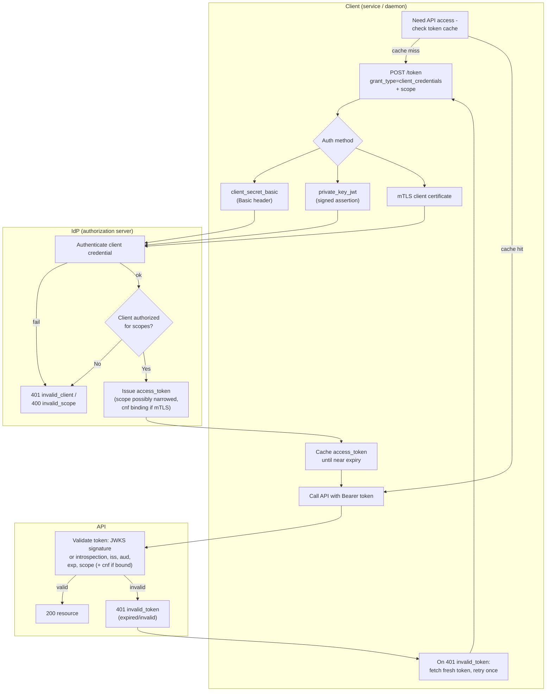

# Client Credentials Grant — Swimlane

Three lanes only: there is no User or Browser in this flow.

```mermaid
flowchart TD
    subgraph Client["Client (service / daemon)"]
        C1["Need API access -<br/>check token cache"]
        C2["POST /token<br/>grant_type=client_credentials<br/>+ scope"]
        C3{"Auth method"}
        C4["client_secret_basic<br/>(Basic header)"]
        C5["private_key_jwt<br/>(signed assertion)"]
        C6["mTLS client certificate"]
        C7["Cache access_token<br/>until near expiry"]
        C8["Call API with Bearer token"]
        C9["On 401 invalid_token:<br/>fetch fresh token, retry once"]
    end

    subgraph IdP["IdP (authorization server)"]
        I1["Authenticate client credential"]
        I2{"Client authorized<br/>for scopes?"}
        I3["Issue access_token<br/>(scope possibly narrowed,<br/>cnf binding if mTLS)"]
        I4["401 invalid_client /<br/>400 invalid_scope"]
    end

    subgraph API
        A1["Validate token: JWKS signature<br/>or introspection, iss, aud,<br/>exp, scope (+ cnf if bound)"]
        A2["200 resource"]
        A3["401 invalid_token<br/>(expired/invalid)"]
    end

    C1 -->|cache miss| C2 --> C3
    C3 --> C4 --> I1
    C3 --> C5 --> I1
    C3 --> C6 --> I1
    I1 -->|fail| I4
    I1 -->|ok| I2
    I2 -->|No| I4
    I2 -->|Yes| I3 --> C7 --> C8 --> A1
    C1 -->|cache hit| C8
    A1 -->|valid| A2
    A1 -->|invalid| A3 --> C9 --> C2
```
