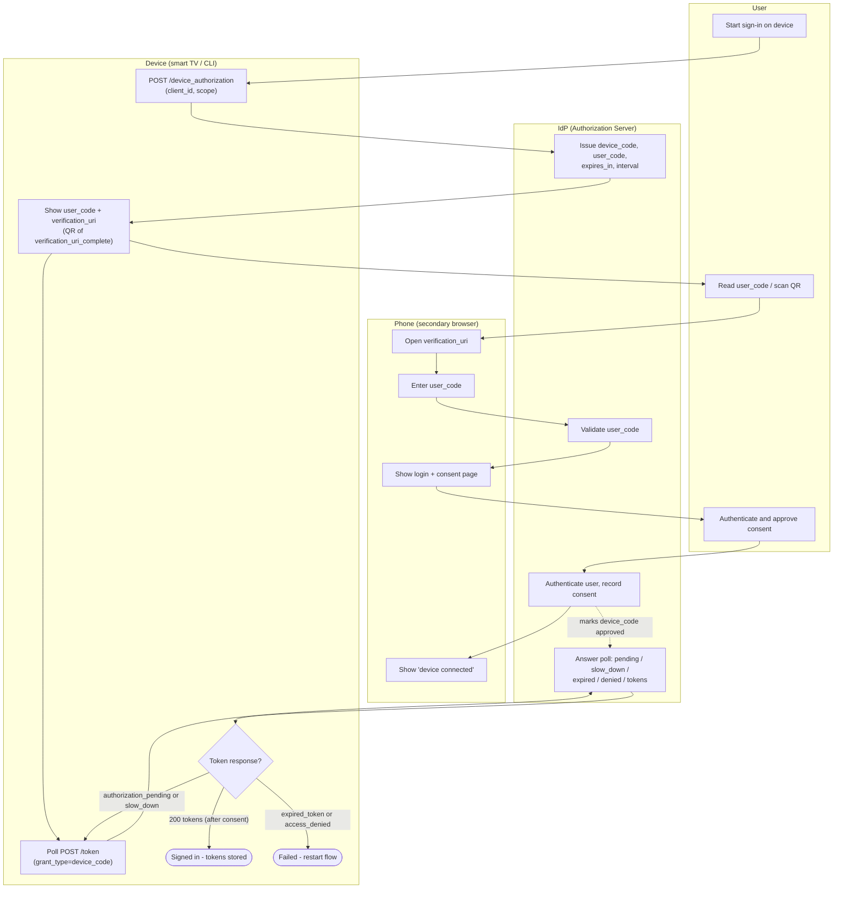

# Device Authorization Grant — Swimlane Diagram

One lane per actor; arrows crossing lanes are handoffs between the constrained
device, the user, the secondary browser device, and the IdP.

Related: [README](./README.md) | [Sequence](./sequence.md) | [Flowchart](./flowchart.md)
