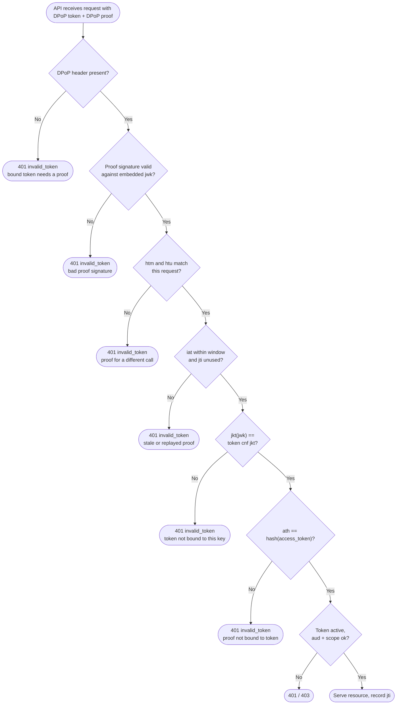

# DPoP — Decision Flowchart

Proof verification at the resource server: signature, HTTP binding, freshness,
and the `cnf.jkt` / `ath` binding to the access token.

```mermaid
flowchart TD
    S(["API receives request with DPoP token + DPoP proof"]) --> Q1{DPoP header present?}
    Q1 -->|No| E1(["401 invalid_token<br/>bound token needs a proof"])
    Q1 -->|Yes| Q2{Proof signature valid<br/>against embedded jwk?}
    Q2 -->|No| E2(["401 invalid_token<br/>bad proof signature"])
    Q2 -->|Yes| Q3{htm and htu match<br/>this request?}
    Q3 -->|No| E3(["401 invalid_token<br/>proof for a different call"])
    Q3 -->|Yes| Q4{iat within window<br/>and jti unused?}
    Q4 -->|No| E4(["401 invalid_token<br/>stale or replayed proof"])
    Q4 -->|Yes| Q5{"jkt(jwk) ==<br/>token cnf jkt?"}
    Q5 -->|No| E5(["401 invalid_token<br/>token not bound to this key"])
    Q5 -->|Yes| Q6{"ath == hash(access_token)?"}
    Q6 -->|No| E6(["401 invalid_token<br/>proof not bound to token"])
    Q6 -->|Yes| Q7{Token active,<br/>aud + scope ok?}
    Q7 -->|No| E7(["401 / 403"])
    Q7 -->|Yes| OK([Serve resource, record jti])
```
