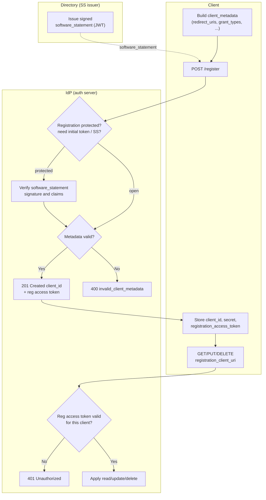

# Dynamic Client Registration — Swimlane

The Client drives registration and self-management; the Directory issues software
statements for protected registration; the IdP validates and persists the record.

