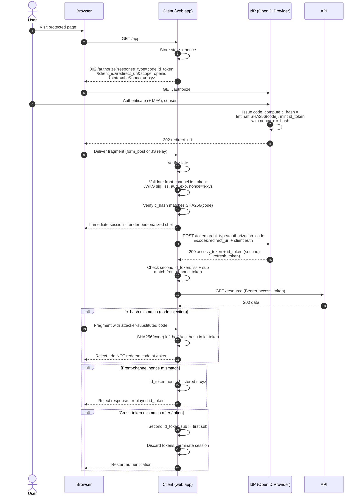

# Hybrid Flow (code id_token) — Sequence Diagram

Happy path with c_hash validation, then the c_hash-mismatch and cross-token
consistency alternates.

```mermaid
sequenceDiagram
    autonumber
    actor User
    participant Browser
    participant Client as Client (web app)
    participant IdP as IdP (OpenID Provider)
    participant API

    User->>Browser: Visit protected page
    Browser->>Client: GET /app
    Client->>Client: Store state + nonce
    Client-->>Browser: 302 /authorize?response_type=code id_token<br/>&client_id&redirect_uri&scope=openid<br/>&state=abc&nonce=n-xyz
    Browser->>IdP: GET /authorize
    User->>IdP: Authenticate (+ MFA), consent
    IdP->>IdP: Issue code, compute c_hash =<br/>left half SHA256(code), mint id_token<br/>with nonce + c_hash
    IdP-->>Browser: 302 redirect_uri#code=SplxlOBe<br/>&id_token=eyJ...&state=abc
    Browser->>Client: Deliver fragment (form_post or JS relay)
    Client->>Client: Verify state
    Client->>Client: Validate front-channel id_token:<br/>JWKS sig, iss, aud, exp, nonce=n-xyz
    Client->>Client: Verify c_hash matches SHA256(code)
    Client-->>Browser: Immediate session - render personalized shell

    Client->>IdP: POST /token grant_type=authorization_code<br/>&code&redirect_uri + client auth
    IdP-->>Client: 200 access_token + id_token (second)<br/>(+ refresh_token)
    Client->>Client: Check second id_token: iss + sub<br/>match front-channel token
    Client->>API: GET /resource (Bearer access_token)
    API-->>Client: 200 data

    alt c_hash mismatch (code injection)
        Browser->>Client: Fragment with attacker-substituted code
        Client->>Client: SHA256(code) left half != c_hash in id_token
        Client-->>Browser: Reject - do NOT redeem code at /token
    end

    alt Front-channel nonce mismatch
        Client->>Client: id_token nonce != stored n-xyz
        Client-->>Browser: Reject response - replayed id_token
    end

    alt Cross-token mismatch after /token
        Client->>Client: Second id_token sub != first sub
        Client->>Client: Discard tokens, terminate session
        Client-->>Browser: Restart authentication
    end
```
