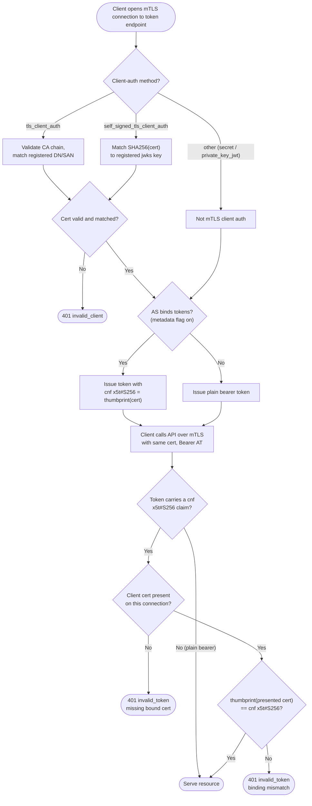

# mTLS Client Auth and Certificate-Bound Tokens — Decision Flowchart

From client authentication method through token binding and the resource-server
proof-of-possession check, with explicit error terminals.

