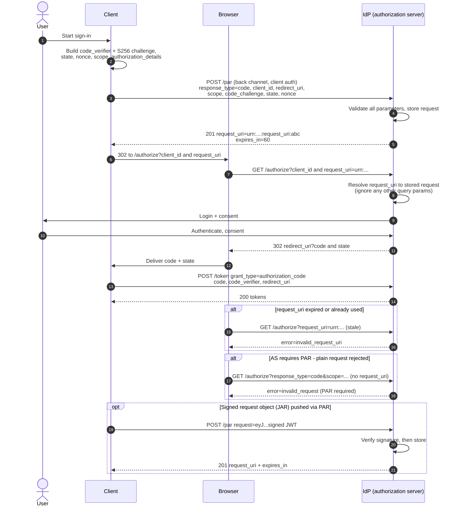

# Pushed Authorization Requests — Sequence Diagram

Happy path: push the request, get a `request_uri`, redirect with it, redeem the
code. Then expiry/reuse, the require-PAR rejection, and a JAR variant.

