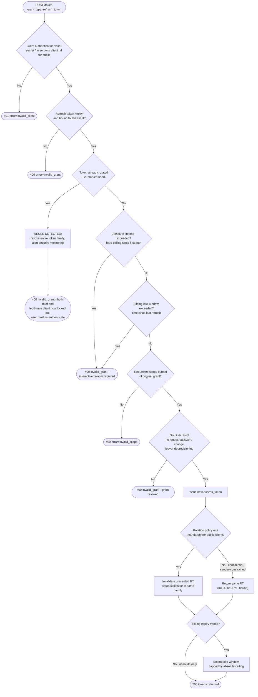

# Refresh Token Grant — Decision Flowchart

The authorization server's view: rotation, reuse detection, and the sliding vs
absolute expiry decision.

```mermaid
flowchart TD
    S(["POST /token grant_type=refresh_token"]) --> Q1{Client authentication valid?<br/>secret / assertion / client_id for public}
    Q1 -->|No| E1(["401 error=invalid_client"])
    Q1 -->|Yes| Q2{Refresh token known<br/>and bound to this client?}
    Q2 -->|No| E2(["400 error=invalid_grant"])
    Q2 -->|Yes| Q3{Token already rotated<br/>- i.e. marked used?}

    Q3 -->|Yes| R1["REUSE DETECTED:<br/>revoke entire token family,<br/>alert security monitoring"]
    R1 --> E3(["400 invalid_grant - both thief and<br/>legitimate client now locked out;<br/>user must re-authenticate"])

    Q3 -->|No| Q4{Absolute lifetime exceeded?<br/>hard ceiling since first auth}
    Q4 -->|Yes| E4(["400 invalid_grant -<br/>interactive re-auth required"])
    Q4 -->|No| Q5{Sliding idle window exceeded?<br/>time since last refresh}
    Q5 -->|Yes| E4
    Q5 -->|No| Q6{Requested scope subset<br/>of original grant?}
    Q6 -->|No| E5(["400 error=invalid_scope"])
    Q6 -->|Yes| Q7{Grant still live?<br/>no logout, password change,<br/>leaver deprovisioning}
    Q7 -->|No| E6(["400 invalid_grant - grant revoked"])
    Q7 -->|Yes| A1["Issue new access_token"]

    A1 --> Q8{Rotation policy on?<br/>mandatory for public clients}
    Q8 -->|Yes| A2["Invalidate presented RT,<br/>issue successor in same family"]
    Q8 -->|"No - confidential,<br/>sender-constrained"| A3["Return same RT<br/>(mTLS or DPoP bound)"]
    A2 --> Q9{Sliding expiry model?}
    A3 --> Q9
    Q9 -->|Yes| A4["Extend idle window,<br/>capped by absolute ceiling"]
    Q9 -->|"No - absolute only"| OK([200 tokens returned])
    A4 --> OK
```
