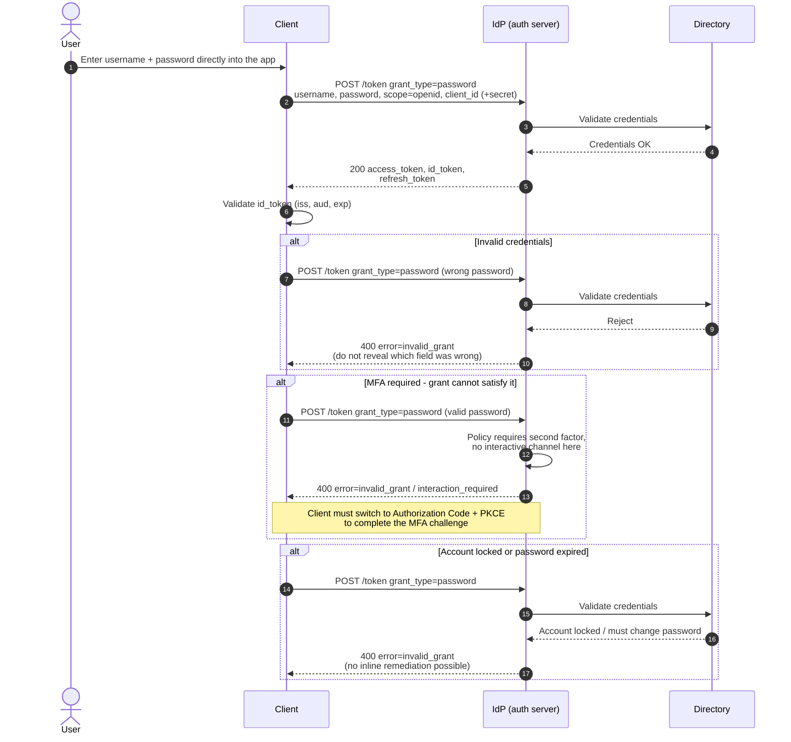

# ROPC — Sequence Diagram

Happy path first, then invalid credentials, an MFA-required case the grant cannot
satisfy, and a locked/expired account.

```mermaid
sequenceDiagram
    autonumber
    actor User
    participant Client
    participant IdP as IdP (auth server)
    participant Dir as Directory

    User->>Client: Enter username + password directly into the app
    Client->>IdP: POST /token grant_type=password<br/>username, password, scope=openid, client_id (+secret)
    IdP->>Dir: Validate credentials
    Dir-->>IdP: Credentials OK
    IdP-->>Client: 200 access_token, id_token,<br/>refresh_token
    Client->>Client: Validate id_token (iss, aud, exp)

    alt Invalid credentials
        Client->>IdP: POST /token grant_type=password (wrong password)
        IdP->>Dir: Validate credentials
        Dir-->>IdP: Reject
        IdP-->>Client: 400 error=invalid_grant<br/>(do not reveal which field was wrong)
    end

    alt MFA required - grant cannot satisfy it
        Client->>IdP: POST /token grant_type=password (valid password)
        IdP->>IdP: Policy requires second factor,<br/>no interactive channel here
        IdP-->>Client: 400 error=invalid_grant / interaction_required
        Note over Client,IdP: Client must switch to Authorization Code + PKCE<br/>to complete the MFA challenge
    end

    alt Account locked or password expired
        Client->>IdP: POST /token grant_type=password
        IdP->>Dir: Validate credentials
        Dir-->>IdP: Account locked / must change password
        IdP-->>Client: 400 error=invalid_grant<br/>(no inline remediation possible)
    end
```
