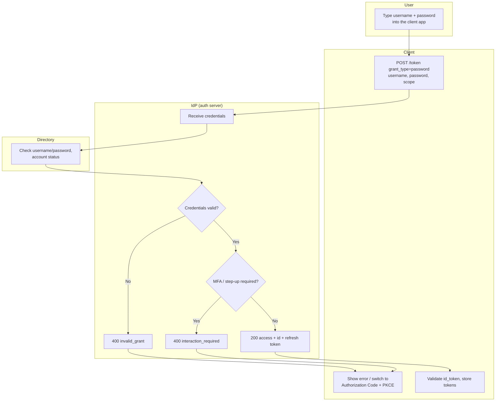

# ROPC — Swimlane

The Client collects the raw password (the anti-pattern) and posts it to `/token`; the
IdP checks it against the Directory. No browser redirect exists.

```mermaid
flowchart TD
    subgraph User
        U1["Type username + password<br/>into the client app"]
    end

    subgraph Client
        C1["POST /token grant_type=password<br/>username, password, scope"]
        C2["Validate id_token, store tokens"]
        C3["Show error / switch to<br/>Authorization Code + PKCE"]
    end

    subgraph IdP["IdP (auth server)"]
        I1["Receive credentials"]
        I2{"Credentials valid?"}
        I3{"MFA / step-up required?"}
        I4["200 access + id + refresh token"]
        I5["400 invalid_grant"]
        I6["400 interaction_required"]
    end

    subgraph Dir["Directory"]
        D1["Check username/password,<br/>account status"]
    end

    U1 --> C1 --> I1 --> D1 --> I2
    I2 -->|No| I5 --> C3
    I2 -->|Yes| I3
    I3 -->|Yes| I6 --> C3
    I3 -->|No| I4 --> C2
```
