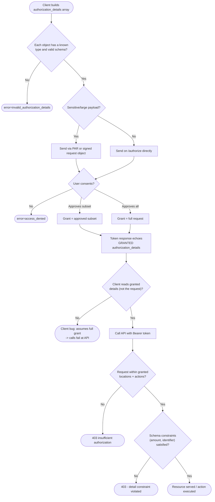

# Rich Authorization Requests — Decision Flowchart

From building `authorization_details` through validation, consent, grant, and
resource-server enforcement, with explicit error terminals.

```mermaid
flowchart TD
    S(["Client builds authorization_details array"]) --> Q1{Each object has a known<br/>type and valid schema?}
    Q1 -->|No| E1(["error=invalid_authorization_details"])
    Q1 -->|Yes| Q2{"Sensitive/large payload?"}
    Q2 -->|Yes| P1["Send via PAR or signed request object"]
    Q2 -->|No| P2["Send on /authorize directly"]

    P1 --> CON{User consents?}
    P2 --> CON
    CON -->|No| E2([error=access_denied])
    CON -->|"Approves subset"| G1["Grant = approved subset"]
    CON -->|"Approves all"| G2["Grant = full request"]

    G1 --> TOK["Token response echoes<br/>GRANTED authorization_details"]
    G2 --> TOK
    TOK --> Q3{"Client reads granted<br/>details (not the request)?"}
    Q3 -->|No| E3(["Client bug: assumes full grant<br/>-> calls fail at API"])
    Q3 -->|Yes| CALL["Call API with Bearer token"]

    CALL --> Q4{"Request within granted<br/>locations + actions?"}
    Q4 -->|No| E4(["403 insufficient authorization"])
    Q4 -->|Yes| Q5{"Schema constraints<br/>(amount, identifier) satisfied?"}
    Q5 -->|No| E5(["403 - detail constraint violated"])
    Q5 -->|Yes| OK([Resource served / action executed])
```
