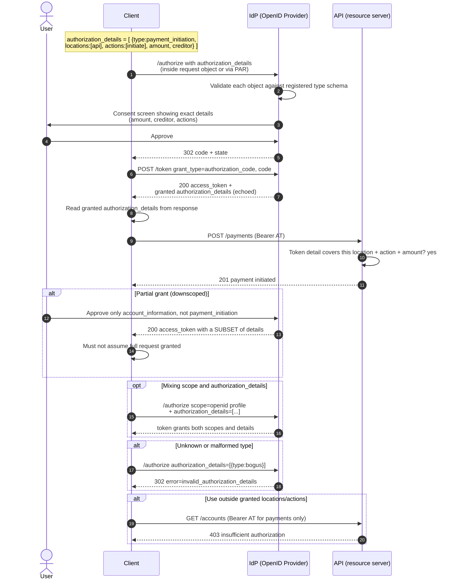

# Rich Authorization Requests — Sequence Diagram

Happy path (full grant) first, then partial grant/downscoping, mixing with scope,
and invalid authorization_details.

```mermaid
sequenceDiagram
    autonumber
    actor User
    participant Client
    participant IdP as IdP (OpenID Provider)
    participant API as API (resource server)

    Note over Client: authorization_details = [ {type:payment_initiation,<br/>locations:[api], actions:[initiate], amount, creditor} ]
    Client->>IdP: /authorize with authorization_details<br/>(inside request object or via PAR)
    IdP->>IdP: Validate each object against registered type schema
    IdP->>User: Consent screen showing exact details<br/>(amount, creditor, actions)
    User->>IdP: Approve
    IdP-->>Client: 302 code + state
    Client->>IdP: POST /token grant_type=authorization_code, code
    IdP-->>Client: 200 access_token +<br/>granted authorization_details (echoed)
    Client->>Client: Read granted authorization_details from response
    Client->>API: POST /payments (Bearer AT)
    API->>API: Token detail covers this location + action + amount? yes
    API-->>Client: 201 payment initiated

    alt Partial grant (downscoped)
        User->>IdP: Approve only account_information, not payment_initiation
        IdP-->>Client: 200 access_token with a SUBSET of details
        Client->>Client: Must not assume full request granted
    end

    opt Mixing scope and authorization_details
        Client->>IdP: /authorize scope=openid profile<br/>+ authorization_details=[...]
        IdP-->>Client: token grants both scopes and details
    end

    alt Unknown or malformed type
        Client->>IdP: /authorize authorization_details=[{type:bogus}]
        IdP-->>Client: 302 error=invalid_authorization_details
    end

    alt Use outside granted locations/actions
        Client->>API: GET /accounts (Bearer AT for payments only)
        API-->>Client: 403 insufficient authorization
    end
```
