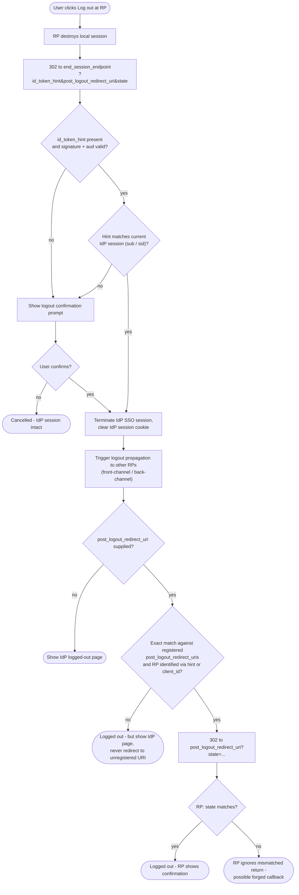

# RP-Initiated Logout — Decision Flowchart

IdP-side decision logic for a request to the `end_session_endpoint`, with the
RP's local-session teardown up front.

Notes

- The unregistered-URI branch still logs the user out; only the redirect is refused.
- Forced-logout CSRF is contained by the confirmation prompt on the no-hint path.

Related: [README](./README.md) | [Sequence](./sequence.md) | [Swimlane](./swimlane.md)
