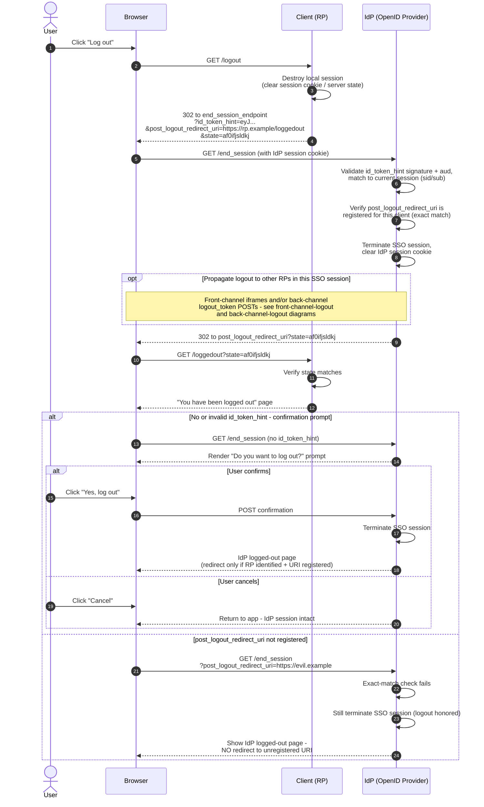

# RP-Initiated Logout — Sequence Diagram

Happy path first (valid `id_token_hint`, registered `post_logout_redirect_uri`),
then confirmation-prompt and invalid-redirect alternates.

Notes

- The RP kills its own session before redirecting, so logout holds even if the user
  never completes the IdP leg.
- An unregistered `post_logout_redirect_uri` downgrades the UX (no return redirect)
  but must never become an open redirect.

Related: [README](./README.md) | [Swimlane](./swimlane.md) | [Flowchart](./flowchart.md)
