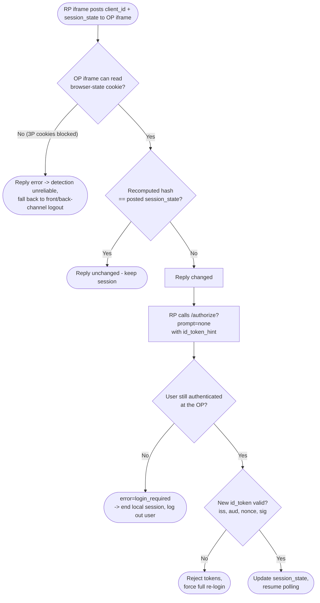

# OIDC Session Management — Decision Flowchart

From an iframe poll through the `postMessage` result and silent re-auth outcome,
with explicit error / logout terminals.

```mermaid
flowchart TD
    S(["RP iframe posts client_id + session_state to OP iframe"]) --> Q1{OP iframe can read<br/>browser-state cookie?}
    Q1 -->|"No (3P cookies blocked)"| E1(["Reply error -> detection unreliable,<br/>fall back to front/back-channel logout"])
    Q1 -->|Yes| Q2{Recomputed hash<br/>== posted session_state?}
    Q2 -->|Yes| CONT([Reply unchanged - keep session])
    Q2 -->|No| CHG["Reply changed"]

    CHG --> RA["RP calls /authorize?prompt=none<br/>with id_token_hint"]
    RA --> Q3{User still authenticated<br/>at the OP?}
    Q3 -->|No| E2(["error=login_required<br/>-> end local session, log out user"])
    Q3 -->|Yes| Q4{New id_token valid?<br/>iss, aud, nonce, sig}
    Q4 -->|No| E3(["Reject tokens,<br/>force full re-login"])
    Q4 -->|Yes| OK(["Update session_state,<br/>resume polling"])
```
