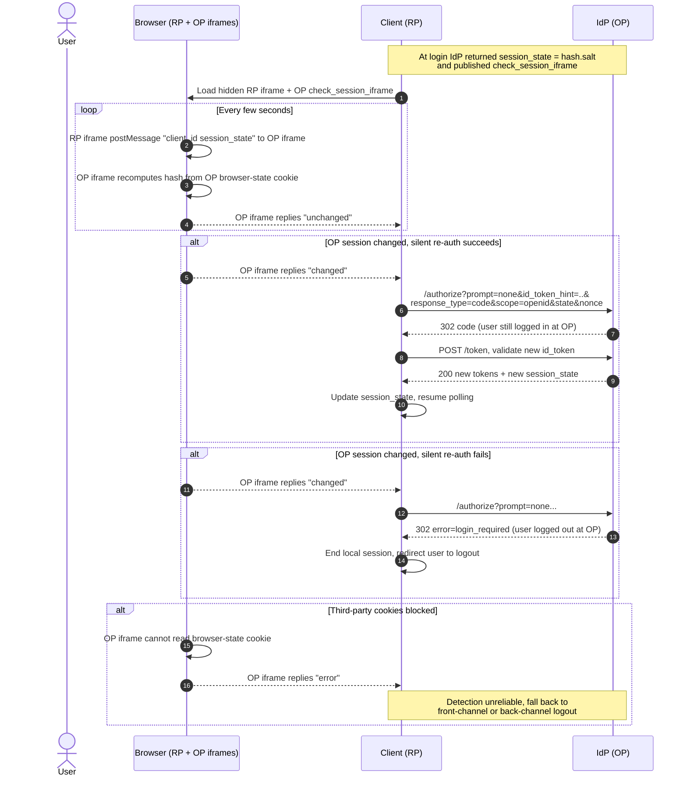

# OIDC Session Management — Sequence Diagram

Happy poll (unchanged) first, then session-changed with successful silent re-auth,
silent re-auth failure, and the cookies-blocked degradation.

```mermaid
sequenceDiagram
    autonumber
    actor User
    participant Br as Browser (RP + OP iframes)
    participant RP as Client (RP)
    participant IdP as IdP (OP)

    Note over RP,IdP: At login IdP returned session_state = hash.salt<br/>and published check_session_iframe
    RP->>Br: Load hidden RP iframe + OP check_session_iframe
    loop Every few seconds
        Br->>Br: RP iframe postMessage "client_id session_state" to OP iframe
        Br->>Br: OP iframe recomputes hash from OP browser-state cookie
        Br-->>RP: OP iframe replies "unchanged"
    end

    alt OP session changed, silent re-auth succeeds
        Br-->>RP: OP iframe replies "changed"
        RP->>IdP: /authorize?prompt=none&id_token_hint=..&<br/>response_type=code&scope=openid&state&nonce
        IdP-->>RP: 302 code (user still logged in at OP)
        RP->>IdP: POST /token, validate new id_token
        IdP-->>RP: 200 new tokens + new session_state
        RP->>RP: Update session_state, resume polling
    end

    alt OP session changed, silent re-auth fails
        Br-->>RP: OP iframe replies "changed"
        RP->>IdP: /authorize?prompt=none...
        IdP-->>RP: 302 error=login_required (user logged out at OP)
        RP->>RP: End local session, redirect user to logout
    end

    alt Third-party cookies blocked
        Br->>Br: OP iframe cannot read browser-state cookie
        Br-->>RP: OP iframe replies "error"
        Note over RP,IdP: Detection unreliable, fall back to<br/>front-channel or back-channel logout
    end
```
