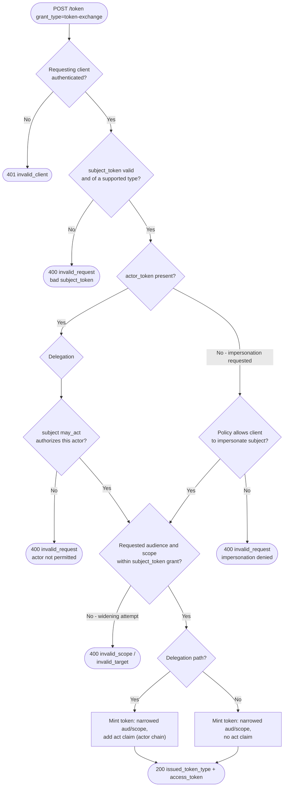

# Token Exchange — Decision Flowchart

The STS's handling of a token-exchange request: subject/actor validation, the
delegation-vs-impersonation branch, and audience narrowing.

```mermaid
flowchart TD
    S(["POST /token grant_type=token-exchange"]) --> Q1{Requesting client<br/>authenticated?}
    Q1 -->|No| E1(["401 invalid_client"])
    Q1 -->|Yes| Q2{subject_token valid<br/>and of a supported type?}
    Q2 -->|No| E2(["400 invalid_request<br/>bad subject_token"])
    Q2 -->|Yes| Q3{actor_token present?}

    Q3 -->|Yes| Q4{Delegation}
    Q4 --> Q5{subject may_act<br/>authorizes this actor?}
    Q5 -->|No| E3(["400 invalid_request<br/>actor not permitted"])
    Q5 -->|Yes| NAR

    Q3 -->|"No - impersonation requested"| Q6{Policy allows client<br/>to impersonate subject?}
    Q6 -->|No| E4(["400 invalid_request<br/>impersonation denied"])
    Q6 -->|Yes| NAR

    NAR{"Requested audience and scope<br/>within subject_token grant?"}
    NAR -->|"No - widening attempt"| E5(["400 invalid_scope /<br/>invalid_target"])
    NAR -->|Yes| Q7{Delegation path?}
    Q7 -->|Yes| M1["Mint token: narrowed aud/scope,<br/>add act claim (actor chain)"]
    Q7 -->|No| M2["Mint token: narrowed aud/scope,<br/>no act claim"]
    M1 --> OK([200 issued_token_type + access_token])
    M2 --> OK
```
