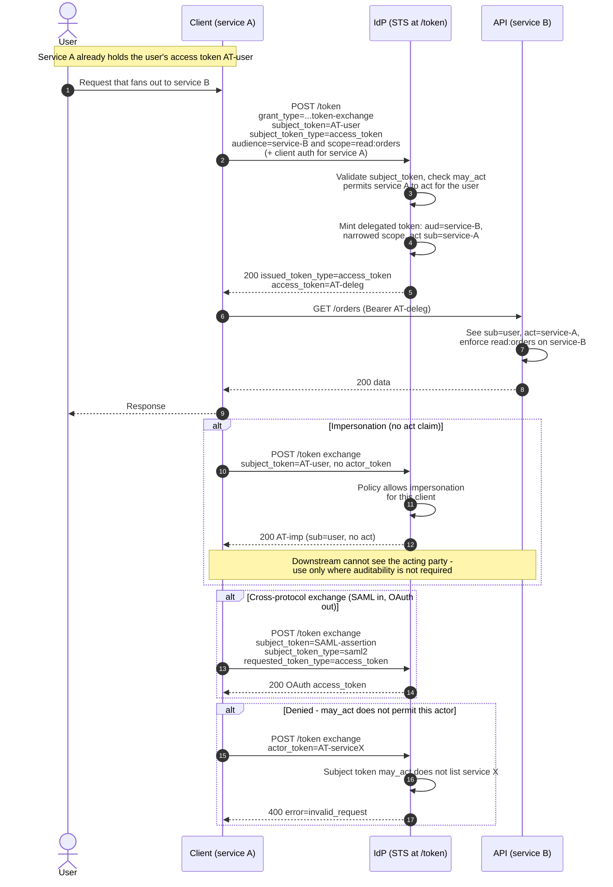

# Token Exchange — Sequence Diagram

Delegation happy path first (with `act` / `may_act` and audience narrowing), then
impersonation, cross-protocol exchange, and a policy denial.

```mermaid
sequenceDiagram
    autonumber
    actor User
    participant Client as Client (service A)
    participant IdP as IdP (STS at /token)
    participant API as API (service B)

    Note over User,Client: Service A already holds the user's access token AT-user
    User->>Client: Request that fans out to service B
    Client->>IdP: POST /token<br/>grant_type=...token-exchange<br/>subject_token=AT-user<br/>subject_token_type=access_token<br/>audience=service-B and scope=read:orders<br/>(+ client auth for service A)
    IdP->>IdP: Validate subject_token, check may_act<br/>permits service A to act for the user
    IdP->>IdP: Mint delegated token: aud=service-B,<br/>narrowed scope, act sub=service-A
    IdP-->>Client: 200 issued_token_type=access_token<br/>access_token=AT-deleg
    Client->>API: GET /orders (Bearer AT-deleg)
    API->>API: See sub=user, act=service-A,<br/>enforce read:orders on service-B
    API-->>Client: 200 data
    Client-->>User: Response

    alt Impersonation (no act claim)
        Client->>IdP: POST /token exchange<br/>subject_token=AT-user, no actor_token
        IdP->>IdP: Policy allows impersonation<br/>for this client
        IdP-->>Client: 200 AT-imp (sub=user, no act)
        Note over Client,API: Downstream cannot see the acting party -<br/>use only where auditability is not required
    end

    alt Cross-protocol exchange (SAML in, OAuth out)
        Client->>IdP: POST /token exchange<br/>subject_token=SAML-assertion<br/>subject_token_type=saml2<br/>requested_token_type=access_token
        IdP-->>Client: 200 OAuth access_token
    end

    alt Denied - may_act does not permit this actor
        Client->>IdP: POST /token exchange<br/>actor_token=AT-serviceX
        IdP->>IdP: Subject token may_act does not list service X
        IdP-->>Client: 400 error=invalid_request
    end
```
