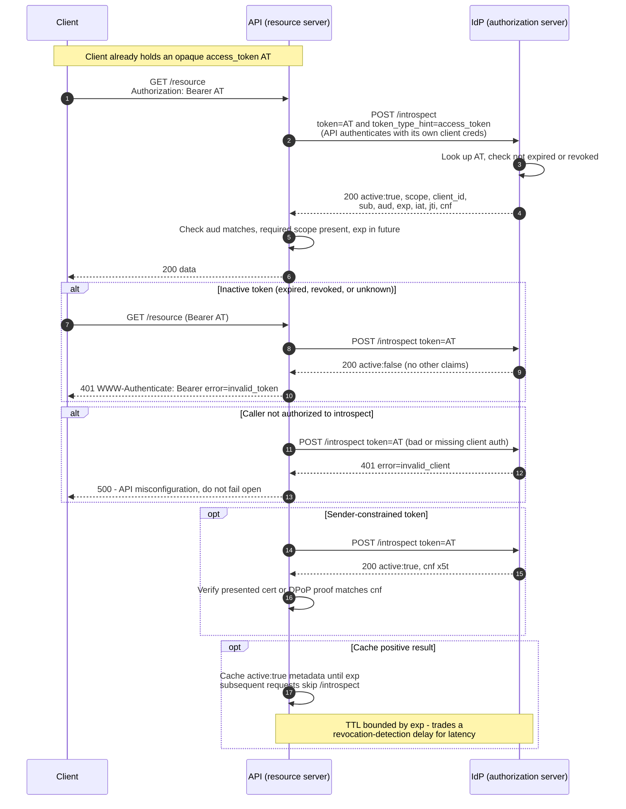

# Token Introspection — Sequence Diagram

Happy path (active token) first, then inactive token, an unauthorized caller,
sender-constrained binding, and result caching.

```mermaid
sequenceDiagram
    autonumber
    participant Client
    participant API as API (resource server)
    participant IdP as IdP (authorization server)

    Note over Client,API: Client already holds an opaque access_token AT
    Client->>API: GET /resource<br/>Authorization: Bearer AT
    API->>IdP: POST /introspect<br/>token=AT and token_type_hint=access_token<br/>(API authenticates with its own client creds)
    IdP->>IdP: Look up AT, check not expired or revoked
    IdP-->>API: 200 active:true, scope, client_id,<br/>sub, aud, exp, iat, jti, cnf
    API->>API: Check aud matches, required scope present, exp in future
    API-->>Client: 200 data

    alt Inactive token (expired, revoked, or unknown)
        Client->>API: GET /resource (Bearer AT)
        API->>IdP: POST /introspect token=AT
        IdP-->>API: 200 active:false (no other claims)
        API-->>Client: 401 WWW-Authenticate: Bearer error=invalid_token
    end

    alt Caller not authorized to introspect
        API->>IdP: POST /introspect token=AT (bad or missing client auth)
        IdP-->>API: 401 error=invalid_client
        API-->>Client: 500 - API misconfiguration, do not fail open
    end

    opt Sender-constrained token
        API->>IdP: POST /introspect token=AT
        IdP-->>API: 200 active:true, cnf x5t#S256 or jkt
        API->>API: Verify presented cert or DPoP proof matches cnf
    end

    opt Cache positive result
        API->>API: Cache active:true metadata until exp<br/>subsequent requests skip /introspect
        Note over API,IdP: TTL bounded by exp - trades a<br/>revocation-detection delay for latency
    end
```
