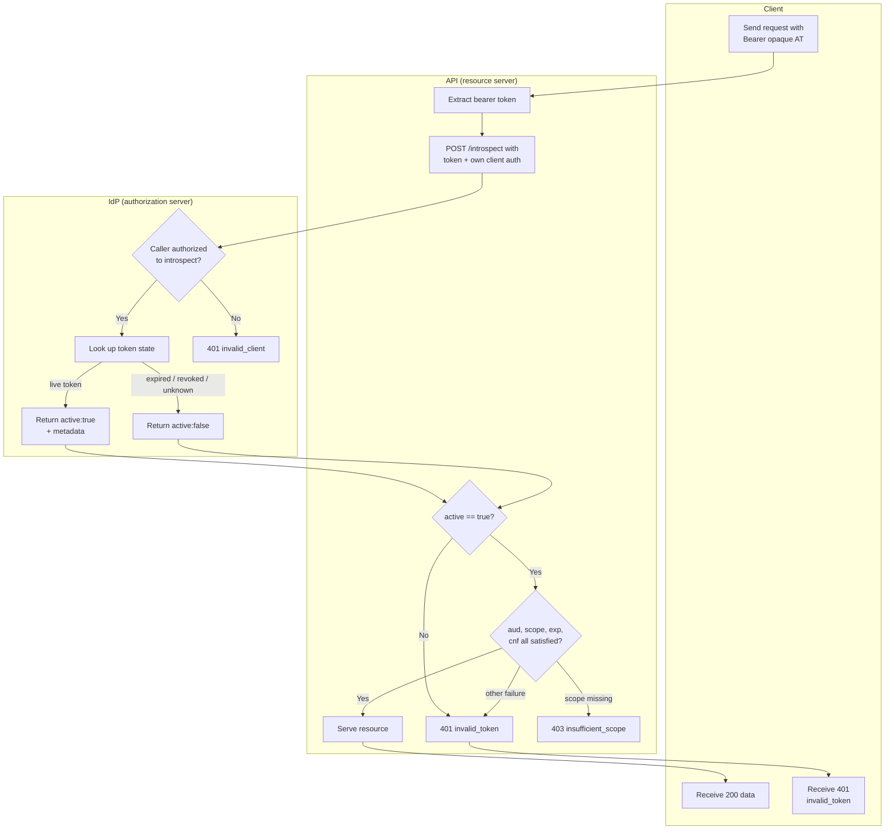

# Token Introspection — Swimlane

The API lane does the introspection call and the enforcement; the IdP lane owns
the active/inactive verdict.

```mermaid
flowchart TD
    subgraph Client
        C1["Send request with<br/>Bearer opaque AT"]
        C2["Receive 200 data"]
        C3["Receive 401<br/>invalid_token"]
    end

    subgraph API["API (resource server)"]
        A1["Extract bearer token"]
        A2["POST /introspect with<br/>token + own client auth"]
        A3{"active == true?"}
        A4{"aud, scope, exp,<br/>cnf all satisfied?"}
        A5["Serve resource"]
        A6["401 invalid_token"]
        A7["403 insufficient_scope"]
    end

    subgraph IdP["IdP (authorization server)"]
        I1{"Caller authorized<br/>to introspect?"}
        I2["Look up token state"]
        I3["Return active:true<br/>+ metadata"]
        I4["Return active:false"]
        I5["401 invalid_client"]
    end

    C1 --> A1 --> A2 --> I1
    I1 -->|No| I5
    I1 -->|Yes| I2
    I2 -->|"live token"| I3 --> A3
    I2 -->|"expired / revoked / unknown"| I4 --> A3
    A3 -->|No| A6 --> C3
    A3 -->|Yes| A4
    A4 -->|"scope missing"| A7
    A4 -->|"other failure"| A6
    A4 -->|Yes| A5 --> C2
```
