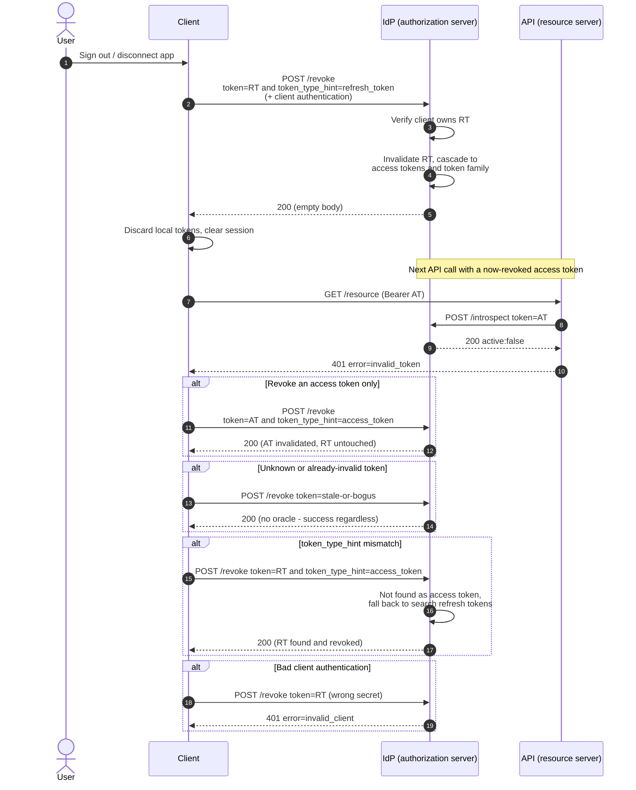

# Token Revocation — Sequence Diagram

Happy path revokes a refresh token and cascades; then access-token-only,
unknown-token, hint-mismatch, and bad-auth alternates.

```mermaid
sequenceDiagram
    autonumber
    actor User
    participant Client
    participant IdP as IdP (authorization server)
    participant API as API (resource server)

    User->>Client: Sign out / disconnect app
    Client->>IdP: POST /revoke<br/>token=RT and token_type_hint=refresh_token<br/>(+ client authentication)
    IdP->>IdP: Verify client owns RT
    IdP->>IdP: Invalidate RT, cascade to<br/>access tokens and token family
    IdP-->>Client: 200 (empty body)
    Client->>Client: Discard local tokens, clear session

    Note over API,IdP: Next API call with a now-revoked access token
    Client->>API: GET /resource (Bearer AT)
    API->>IdP: POST /introspect token=AT
    IdP-->>API: 200 active:false
    API-->>Client: 401 error=invalid_token

    alt Revoke an access token only
        Client->>IdP: POST /revoke<br/>token=AT and token_type_hint=access_token
        IdP-->>Client: 200 (AT invalidated, RT untouched)
    end

    alt Unknown or already-invalid token
        Client->>IdP: POST /revoke token=stale-or-bogus
        IdP-->>Client: 200 (no oracle - success regardless)
    end

    alt token_type_hint mismatch
        Client->>IdP: POST /revoke token=RT and token_type_hint=access_token
        IdP->>IdP: Not found as access token,<br/>fall back to search refresh tokens
        IdP-->>Client: 200 (RT found and revoked)
    end

    alt Bad client authentication
        Client->>IdP: POST /revoke token=RT (wrong secret)
        IdP-->>Client: 401 error=invalid_client
    end
```
