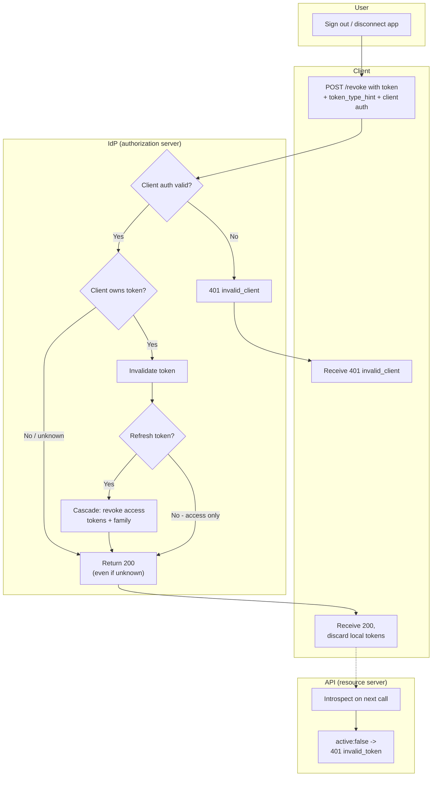

# Token Revocation — Swimlane

The IdP lane owns ownership checks and the cascade; the API lane shows the effect
of a revoked token on the next call.

```mermaid
flowchart TD
    subgraph User
        U1["Sign out / disconnect app"]
    end

    subgraph Client
        C1["POST /revoke with token<br/>+ token_type_hint + client auth"]
        C2["Receive 200,<br/>discard local tokens"]
        C3["Receive 401 invalid_client"]
    end

    subgraph IdP["IdP (authorization server)"]
        I1{"Client auth valid?"}
        I2{"Client owns token?"}
        I3["Invalidate token"]
        I4{"Refresh token?"}
        I5["Cascade: revoke access<br/>tokens + family"]
        I6["Return 200<br/>(even if unknown)"]
        I7["401 invalid_client"]
    end

    subgraph API["API (resource server)"]
        A1["Introspect on next call"]
        A2["active:false -><br/>401 invalid_token"]
    end

    U1 --> C1 --> I1
    I1 -->|No| I7 --> C3
    I1 -->|Yes| I2
    I2 -->|"No / unknown"| I6
    I2 -->|Yes| I3 --> I4
    I4 -->|Yes| I5 --> I6
    I4 -->|"No - access only"| I6
    I6 --> C2
    C2 -.-> A1 --> A2
```
