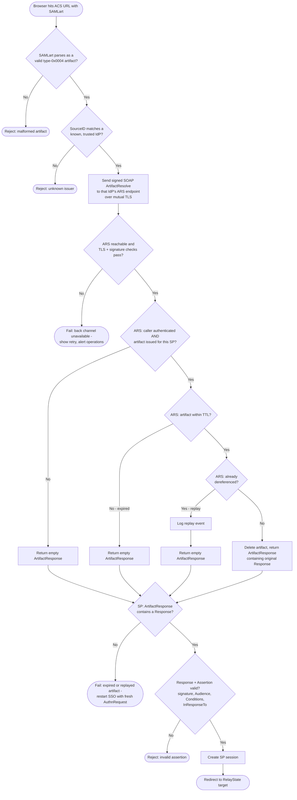

# HTTP-Artifact Binding — Decision Flowchart

Two decision clusters: the ARS deciding whether to release the stored message, and the
SP deciding what to do with the `ArtifactResponse`.

Notes

- The ARS answers every unauthorized, expired, or replayed request the same way — an
  empty `ArtifactResponse` — so probing callers learn nothing.
- The SP treats an empty response as a soft failure (restart SSO), but a *replay
  detected at the ARS* is IdP-side signal worth alerting on: someone re-used a
  `SAMLart` URL.
- Back-channel unreachability is an operational failure mode unique to this binding;
  monitor it separately from assertion-validation errors.
