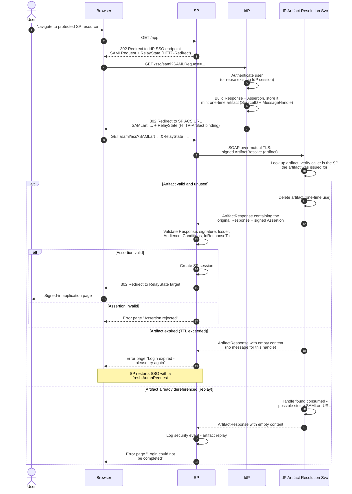

# HTTP-Artifact Binding — Sequence Diagram

Happy path: SP-initiated SSO where the IdP returns an artifact by redirect and the SP
resolves it over back-channel SOAP at the Artifact Resolution Service (ARS). Alt
blocks: expired artifact and already-dereferenced (replayed) artifact.

Notes

- The browser never carries the assertion — only the 44-byte artifact reference in
  `SAMLart`; the sensitive payload moves on the SP-to-ARS SOAP channel (steps 9–12).
- `ArtifactResolve` is signed and the transport is mutually authenticated TLS; the ARS
  additionally checks the artifact belongs to the calling SP.
- Both failure alternates return an *empty* `ArtifactResponse` rather than an error
  detail, by design — the caller learns nothing about a handle it should not have.
