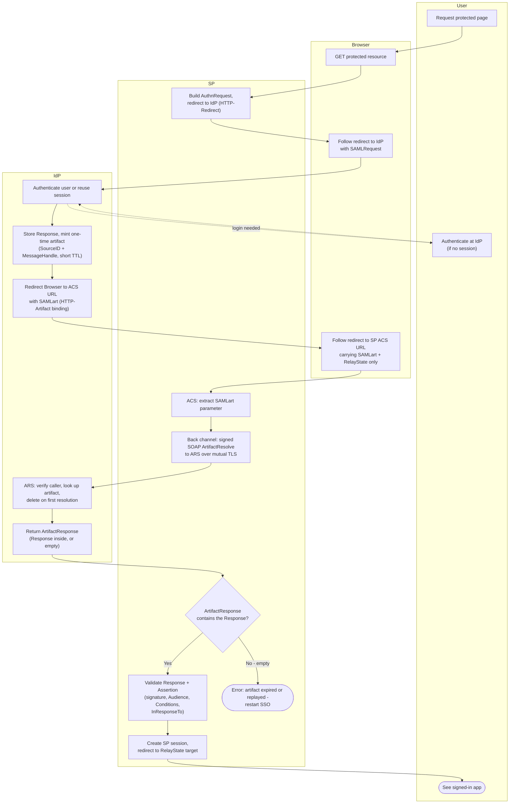

# HTTP-Artifact Binding — Swimlane Diagram

Lanes for User, Browser, SP, IdP. The IdP lane contains both the SSO endpoint and the
Artifact Resolution Service; the SP-to-ARS arrows are the back channel, bypassing the
Browser lane entirely.

Notes

- Front channel: `S1 -> B2 -> I1` and `I3 -> B3 -> S2`. Back channel: `S3 -> I4 -> I5`.
  The assertion only ever exists on the back channel.
- `I4` enforces both one-time use (delete on resolve) and audience binding (artifact
  resolvable only by the SP it was issued for).
