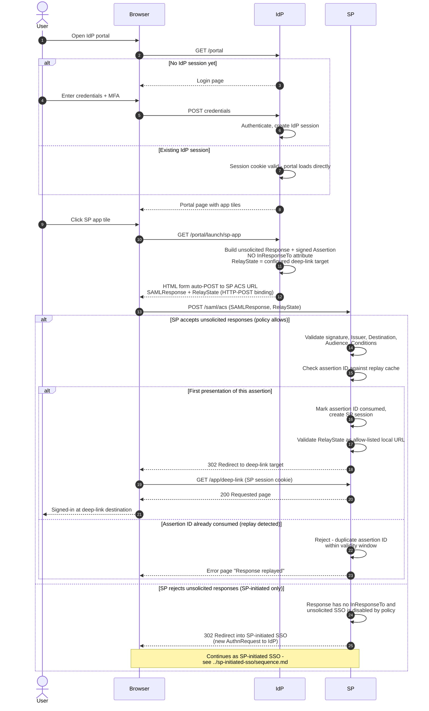

# IdP-Initiated SSO — Sequence Diagram

Happy path: user clicks an app tile on the IdP portal and the IdP posts an unsolicited
`Response` to the SP ACS URL. Alternates: SP policy rejects unsolicited responses, and
replay of a previously consumed assertion.

Notes

- There is no `AuthnRequest` anywhere in the happy path — the `Response` is unsolicited
  by definition, which is why `InResponseTo` is absent.
- The rejection branch shows the common graceful fallback: bounce the user into
  SP-initiated SSO instead of a hard error.
- Replay protection rests entirely on the assertion-ID cache and the short
  `NotOnOrAfter` window, since request correlation is unavailable.
