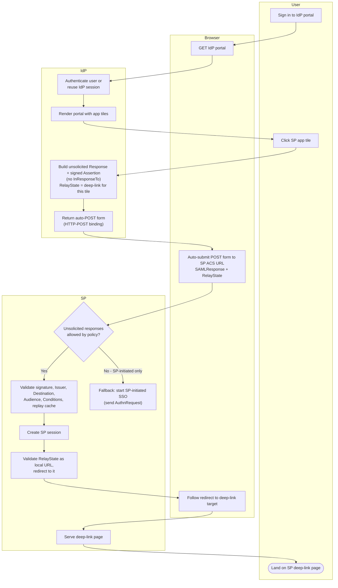

# IdP-Initiated SSO — Swimlane Diagram

Lanes for User, Browser, IdP, SP. The flow begins in the IdP lane (portal), the
reverse of SP-initiated SSO.

Notes

- `S6` hands off to the [SP-initiated SSO swimlane](../sp-initiated-sso/swimlane.md);
  the user still reaches the app, but with proper request correlation.
- Validation failures inside `S2` (bad signature, expired conditions, replayed
  assertion ID) terminate the flow — see [flowchart.md](./flowchart.md).
