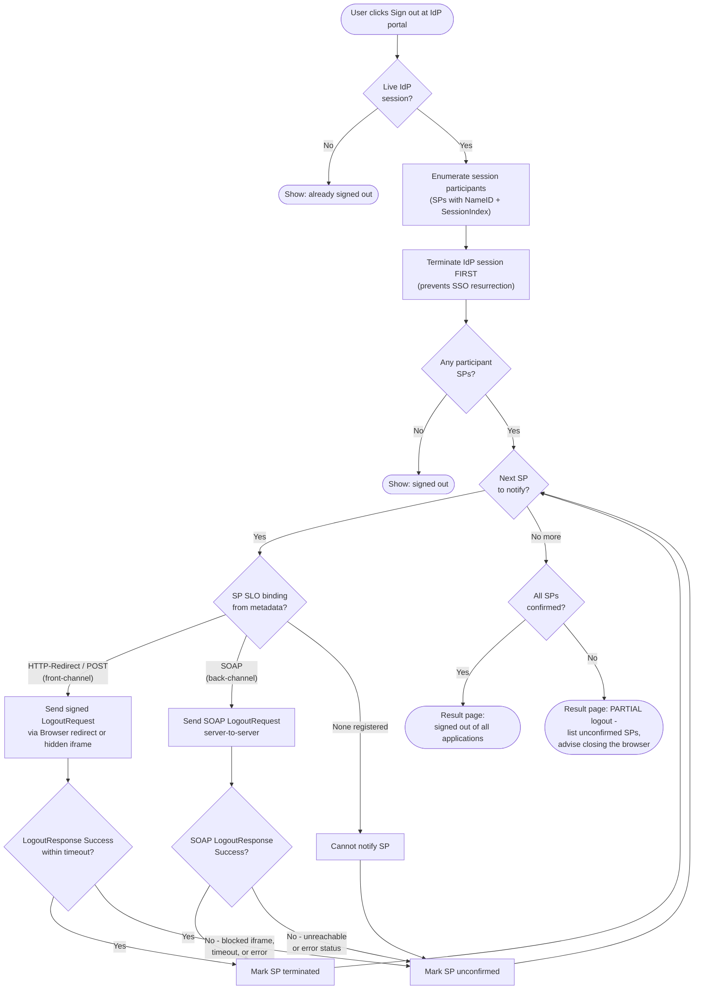

# IdP-Initiated Single Logout — Decision Flowchart

IdP-side logic: session lookup, mandatory self-termination first, per-SP binding
selection, timeout handling, and aggregation into a complete- or partial-logout result.

Notes

- `KillIdP` before the loop is the key ordering rule: even if every notification
  fails, seamless SSO can no longer re-mint SP sessions.
- SPs with no registered SLO endpoint are a silent gap — flag them at onboarding time,
  not at logout time.
- Front-channel confirmations that never arrive must be treated as failures, not
  successes; browsers give no error signal for blocked third-party frames.
