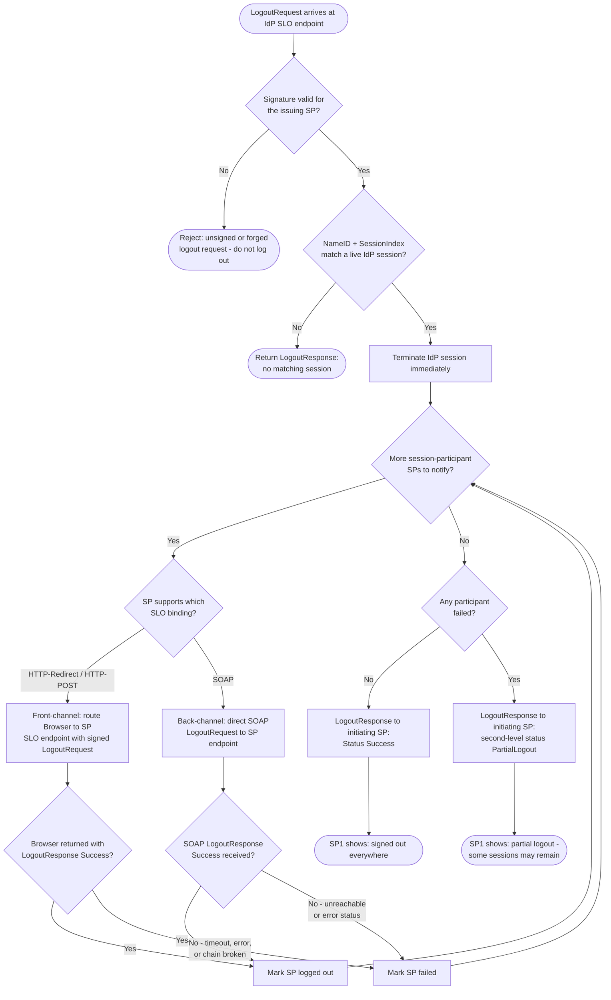

# SP-Initiated Single Logout — Decision Flowchart

Focus: IdP-side validation, the propagation loop over session participants, binding
selection, and how failures roll up into a `PartialLogout` status.

Notes

- The signature gate is critical: accepting unsigned `LogoutRequest`s lets any attacker
  force-logout users (denial of service) or disguise session fixation.
- The IdP session dies before propagation begins, so a broken front-channel chain can
  strand SP sessions but never revive SSO.
- `PartialLogout` is a signal to the UI, not an error: the initiating SP should tell
  the user to close the browser to clear any surviving sessions.
