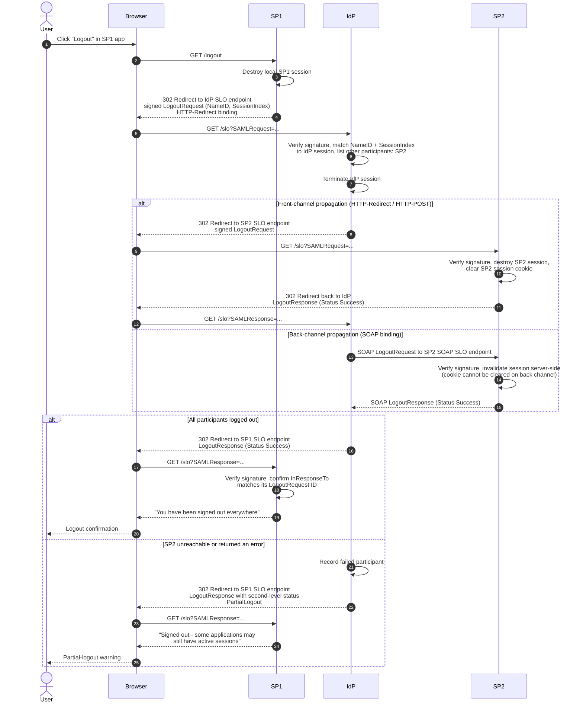

# SP-Initiated Single Logout — Sequence Diagram

Happy path: logout at SP1, IdP propagates to SP2 over the front channel, everything
succeeds. Alt blocks show back-channel SOAP propagation and the partial-logout outcome.

Notes

- `SessionIndex` scopes the logout to the SSO session established by a specific
  assertion; omitting it logs the `NameID` out of all sessions.
- In front-channel mode with N participants, steps 8–12 repeat once per SP before the
  IdP answers SP1.
- The IdP terminates its own session *before* propagation so that a broken chain can
  never leave the IdP session alive.
