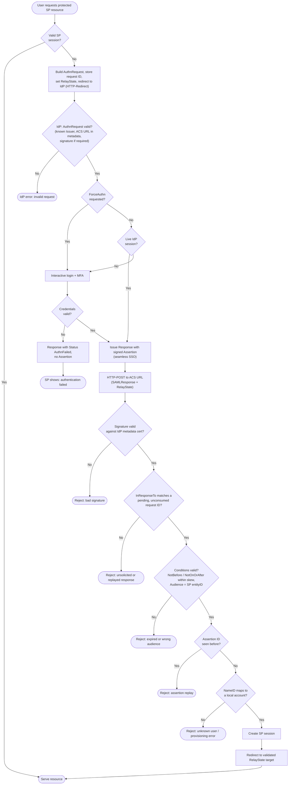

# SP-Initiated SSO — Decision Flowchart

SP-side logic with every validation gate the ACS endpoint must apply, plus the IdP-side
session decision. Error paths terminate explicitly.

Notes

- The signature gate comes first: nothing after it can be trusted until the XML
  signature verifies against the certificate published in IdP metadata.
- `RelayState` is validated as an allow-listed relative URL before the final redirect
  to prevent open-redirect abuse.
- The replay gate requires a cache of consumed assertion IDs held at least until each
  assertion's `NotOnOrAfter`.
