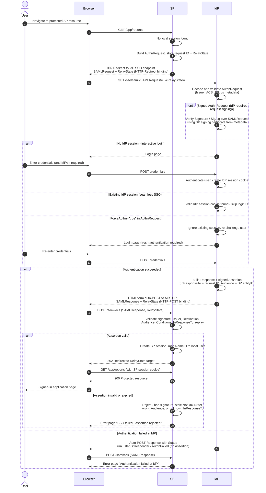

# SP-Initiated SSO — Sequence Diagram

Happy path first (fresh IdP login), then alternates: seamless SSO with an existing IdP
session, authentication failure, invalid/expired assertion, `ForceAuthn`, and signed
`AuthnRequest`.

Notes

- Steps 5–6 are the HTTP-Redirect binding: `AuthnRequest` is DEFLATE-compressed,
  base64-encoded, and URL-encoded into the `SAMLRequest` parameter.
- The auto-POST in the success branch is the HTTP-POST binding: a self-submitting HTML
  form carrying `SAMLResponse` and the unchanged `RelayState`.
- Replay protection: the SP marks the `InResponseTo` ID consumed and caches the
  assertion ID until `NotOnOrAfter`.
