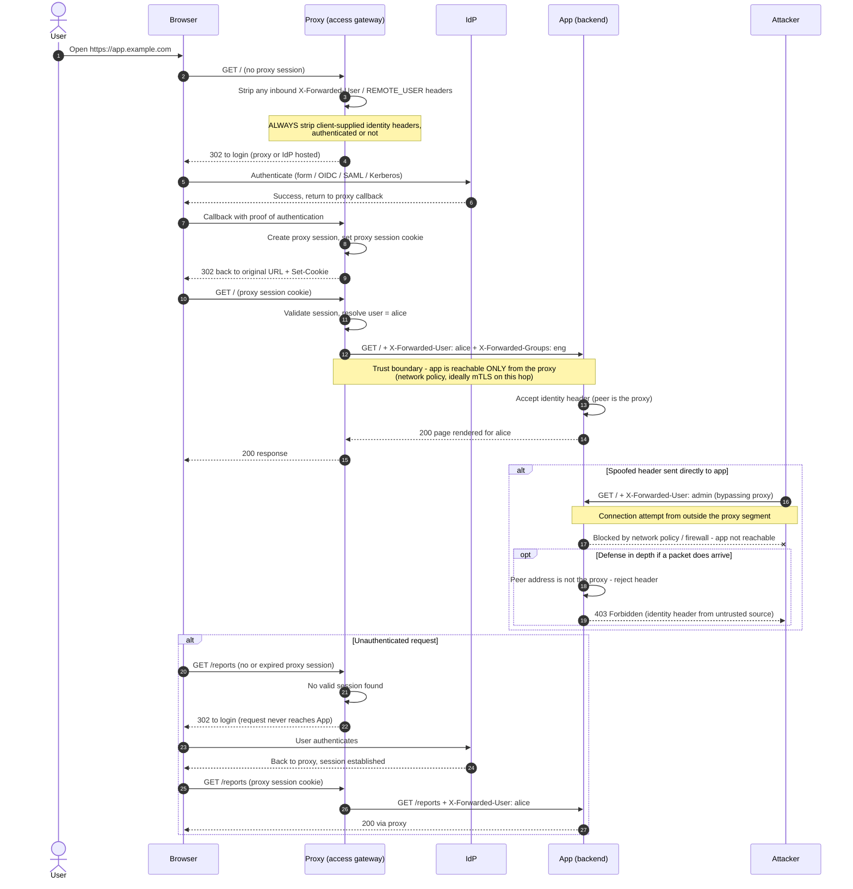

# Header-Based SSO — Sequence Diagram

Happy path: proxy authenticates the user, injects identity headers, app trusts
them. Alternates: spoofed header direct-to-app (blocked by network policy),
unauthenticated request redirected to login.

