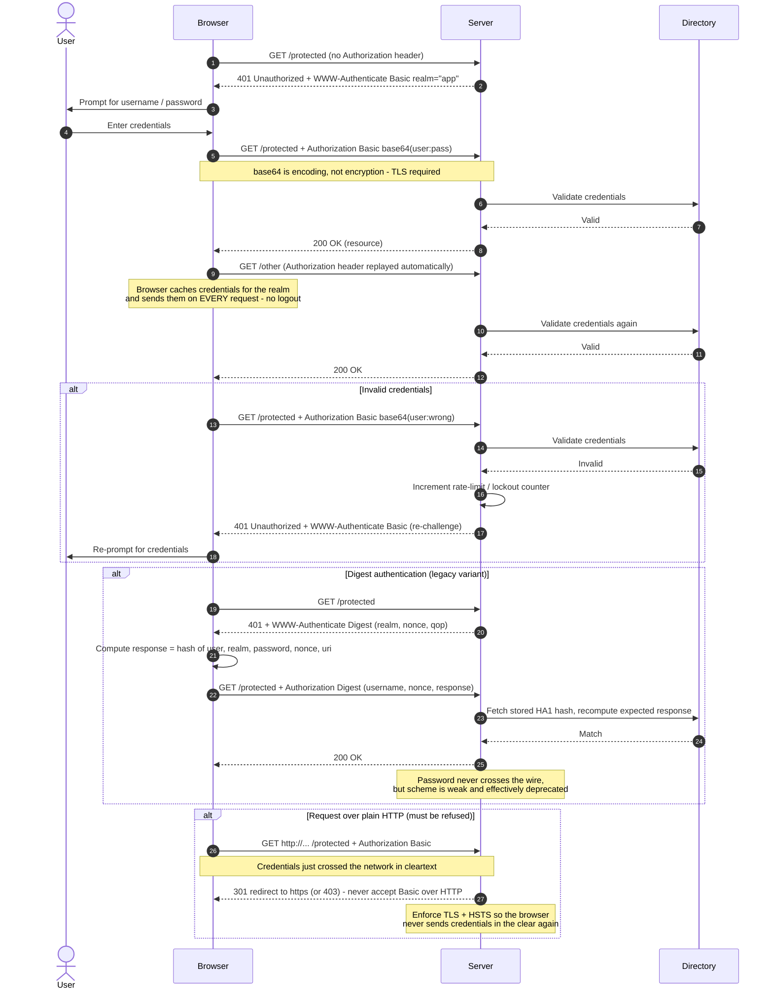

# HTTP Basic Authentication — Sequence Diagram

Happy path: 401 challenge, credentials replayed on every request. Alternates:
invalid credentials, Digest challenge-response, plain-HTTP rejection.

```mermaid
sequenceDiagram
    autonumber
    actor User
    participant Browser
    participant Server
    participant Dir as Directory

    %% ----- happy path -----
    Browser->>Server: GET /protected (no Authorization header)
    Server-->>Browser: 401 Unauthorized + WWW-Authenticate Basic realm="app"
    Browser->>User: Prompt for username / password
    User->>Browser: Enter credentials
    Browser->>Server: GET /protected + Authorization Basic base64(user:pass)
    Note over Browser,Server: base64 is encoding, not encryption - TLS required
    Server->>Dir: Validate credentials
    Dir-->>Server: Valid
    Server-->>Browser: 200 OK (resource)
    Browser->>Server: GET /other (Authorization header replayed automatically)
    Note over Browser: Browser caches credentials for the realm<br/>and sends them on EVERY request - no logout
    Server->>Dir: Validate credentials again
    Dir-->>Server: Valid
    Server-->>Browser: 200 OK

    %% ----- alternates -----
    alt Invalid credentials
        Browser->>Server: GET /protected + Authorization Basic base64(user:wrong)
        Server->>Dir: Validate credentials
        Dir-->>Server: Invalid
        Server->>Server: Increment rate-limit / lockout counter
        Server-->>Browser: 401 Unauthorized + WWW-Authenticate Basic (re-challenge)
        Browser->>User: Re-prompt for credentials
    end

    alt Digest authentication (legacy variant)
        Browser->>Server: GET /protected
        Server-->>Browser: 401 + WWW-Authenticate Digest (realm, nonce, qop)
        Browser->>Browser: Compute response = hash of user, realm, password, nonce, uri
        Browser->>Server: GET /protected + Authorization Digest (username, nonce, response)
        Server->>Dir: Fetch stored HA1 hash, recompute expected response
        Dir-->>Server: Match
        Server-->>Browser: 200 OK
        Note over Server: Password never crosses the wire,<br/>but scheme is weak and effectively deprecated
    end

    alt Request over plain HTTP (must be refused)
        Browser->>Server: GET http://... /protected + Authorization Basic
        Note over Browser,Server: Credentials just crossed the network in cleartext
        Server-->>Browser: 301 redirect to https (or 403) - never accept Basic over HTTP
        Note over Server: Enforce TLS + HSTS so the browser<br/>never sends credentials in the clear again
    end
```
