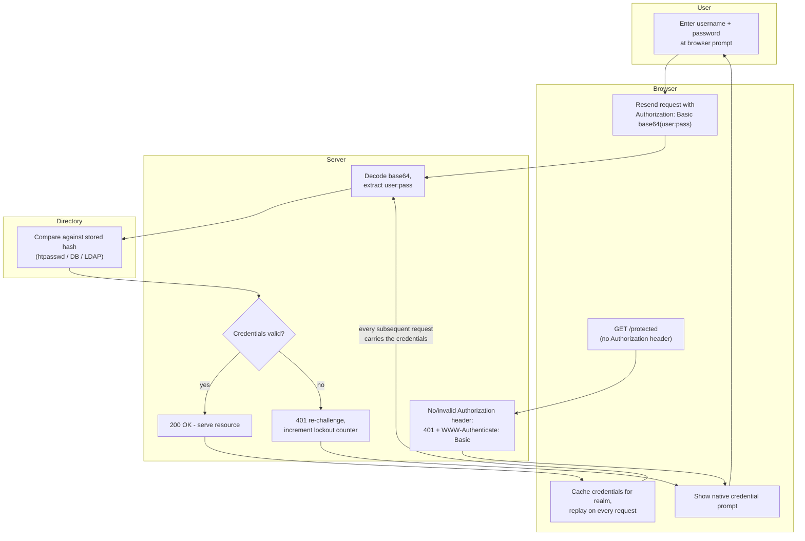

# HTTP Basic Authentication — Swimlane

```mermaid
flowchart TD
    subgraph User
        U1["Enter username + password<br/>at browser prompt"]
    end

    subgraph Browser
        B1["GET /protected<br/>(no Authorization header)"]
        B2["Show native credential prompt"]
        B3["Resend request with<br/>Authorization: Basic base64(user:pass)"]
        B4["Cache credentials for realm,<br/>replay on every request"]
    end

    subgraph Server
        S1["No/invalid Authorization header:<br/>401 + WWW-Authenticate: Basic"]
        S2["Decode base64,<br/>extract user:pass"]
        S3{"Credentials valid?"}
        S4["200 OK - serve resource"]
        S5["401 re-challenge,<br/>increment lockout counter"]
    end

    subgraph Directory
        D1["Compare against stored hash<br/>(htpasswd / DB / LDAP)"]
    end

    B1 --> S1
    S1 --> B2
    B2 --> U1
    U1 --> B3
    B3 --> S2
    S2 --> D1
    D1 --> S3
    S3 -->|yes| S4
    S3 -->|no| S5
    S5 --> B2
    S4 --> B4
    B4 -->|"every subsequent request<br/>carries the credentials"| S2
```
