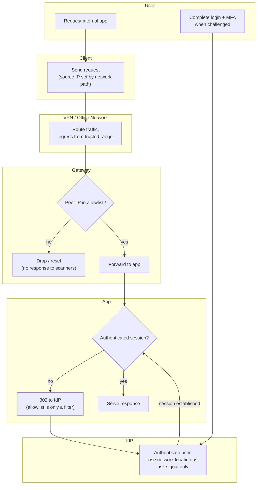

# IP Allowlist / Network-Location Authentication — Swimlane

```mermaid
flowchart TD
    subgraph User
        U1["Request internal app"]
        U2["Complete login + MFA<br/>when challenged"]
    end

    subgraph Client
        C1["Send request<br/>(source IP set by network path)"]
    end

    subgraph VPN["VPN / Office Network"]
        V1["Route traffic,<br/>egress from trusted range"]
    end

    subgraph Gateway
        G1{"Peer IP in allowlist?"}
        G2["Forward to app"]
        G3["Drop / reset<br/>(no response to scanners)"]
    end

    subgraph App
        A1{"Authenticated session?"}
        A2["302 to IdP<br/>(allowlist is only a filter)"]
        A3["Serve response"]
    end

    subgraph IdP
        I1["Authenticate user,<br/>use network location as<br/>risk signal only"]
    end

    U1 --> C1 --> V1 --> G1
    G1 -->|no| G3
    G1 -->|yes| G2 --> A1
    A1 -->|no| A2 --> I1
    U2 --> I1
    I1 -->|"session established"| A1
    A1 -->|yes| A3
```
