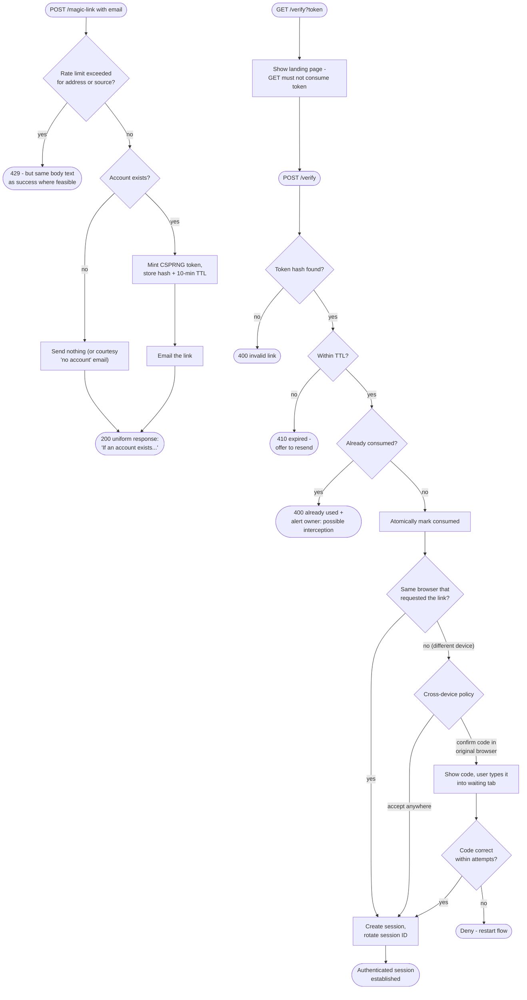

# Magic Link — Decision Flowchart

Two phases: issuing the link (with enumeration protection) and verifying it
(with expiry, single-use, and cross-device branches).

```mermaid
flowchart TD
    %% ----- issue phase -----
    Req(["POST /magic-link with email"]) --> Rate{"Rate limit exceeded<br/>for address or source?"}
    Rate -->|yes| ERate(["429 - but same body text<br/>as success where feasible"])
    Rate -->|no| Exists{"Account exists?"}
    Exists -->|no| Silent["Send nothing (or courtesy<br/>'no account' email)"]
    Exists -->|yes| Mint["Mint CSPRNG token,<br/>store hash + 10-min TTL"]
    Mint --> Send["Email the link"]
    Silent --> Uniform(["200 uniform response:<br/>'If an account exists...'"])
    Send --> Uniform

    %% ----- verify phase -----
    Click(["GET /verify?token"]) --> Land["Show landing page -<br/>GET must not consume token"]
    Land --> Confirm(["POST /verify"])
    Confirm --> Found{"Token hash found?"}
    Found -->|no| EBad(["400 invalid link"])
    Found -->|yes| Exp{"Within TTL?"}
    Exp -->|no| EExp(["410 expired -<br/>offer to resend"])
    Exp -->|yes| Used{"Already consumed?"}
    Used -->|yes| EReuse(["400 already used +<br/>alert owner: possible interception"])
    Used -->|no| Consume["Atomically mark consumed"]
    Consume --> Device{"Same browser that<br/>requested the link?"}
    Device -->|yes| Sess["Create session,<br/>rotate session ID"]
    Device -->|"no (different device)"| Policy{"Cross-device policy"}
    Policy -->|"accept anywhere"| Sess
    Policy -->|"confirm code in<br/>original browser"| Code["Show code, user types it<br/>into waiting tab"]
    Code --> CodeOk{"Code correct<br/>within attempts?"}
    CodeOk -->|no| ECode(["Deny - restart flow"])
    CodeOk -->|yes| Sess
    Sess --> OK(["Authenticated session<br/>established"])
```
