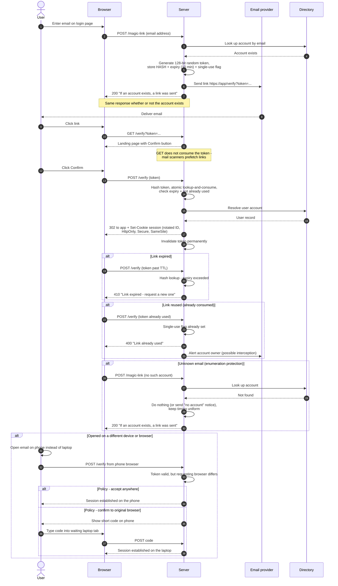

# Magic Link — Sequence Diagram

Happy path: request link, receive email, click, session established. Alternates:
expired link, reused link, enumeration protection, different-device open.

```mermaid
sequenceDiagram
    autonumber
    actor User
    participant Browser
    participant Server
    participant Email as Email provider
    participant Dir as Directory

    %% ----- happy path -----
    User->>Browser: Enter email on login page
    Browser->>Server: POST /magic-link (email address)
    Server->>Dir: Look up account by email
    Dir-->>Server: Account exists
    Server->>Server: Generate 128-bit random token,<br/>store HASH + expiry (10 min) + single-use flag
    Server->>Email: Send link https://app/verify?token=...
    Server-->>Browser: 200 "If an account exists, a link was sent"
    Note over Server,Browser: Same response whether or not the account exists
    Email-->>User: Deliver email
    User->>Browser: Click link
    Browser->>Server: GET /verify?token=...
    Server-->>Browser: Landing page with Confirm button
    Note over Server: GET does not consume the token -<br/>mail scanners prefetch links
    User->>Browser: Click Confirm
    Browser->>Server: POST /verify (token)
    Server->>Server: Hash token, atomic lookup-and-consume,<br/>check expiry + not already used
    Server->>Dir: Resolve user account
    Dir-->>Server: User record
    Server-->>Browser: 302 to app + Set-Cookie session (rotated ID,<br/>HttpOnly, Secure, SameSite)
    Server->>Server: Invalidate token permanently

    %% ----- alternates -----
    alt Link expired
        Browser->>Server: POST /verify (token past TTL)
        Server->>Server: Hash lookup - expiry exceeded
        Server-->>Browser: 410 "Link expired - request a new one"
    end

    alt Link reused (already consumed)
        Browser->>Server: POST /verify (token already used)
        Server->>Server: Single-use flag already set
        Server-->>Browser: 400 "Link already used"
        Server->>Email: Alert account owner (possible interception)
    end

    alt Unknown email (enumeration protection)
        Browser->>Server: POST /magic-link (no such account)
        Server->>Dir: Look up account
        Dir-->>Server: Not found
        Server->>Server: Do nothing (or send "no account" notice),<br/>keep timing uniform
        Server-->>Browser: 200 "If an account exists, a link was sent"
    end

    alt Opened on a different device or browser
        User->>User: Open email on phone instead of laptop
        User->>Server: POST /verify from phone browser
        Server->>Server: Token valid, but requesting browser differs
        alt Policy - accept anywhere
            Server-->>User: Session established on the phone
        else Policy - confirm to original browser
            Server-->>User: Show short code on phone
            User->>Browser: Type code into waiting laptop tab
            Browser->>Server: POST code
            Server-->>Browser: Session established on the laptop
        end
    end
```
