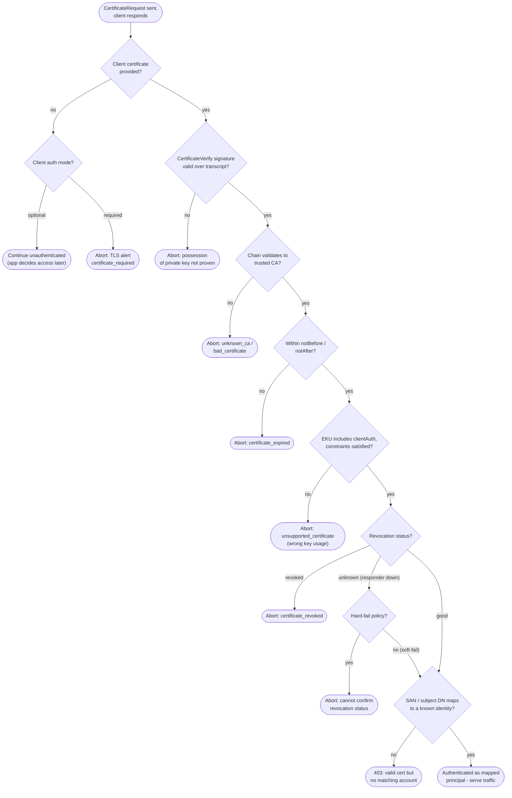

# Mutual TLS — Validation Flowchart

Server-side certificate validation pipeline with explicit failure terminals.

```mermaid
flowchart TD
    Start(["CertificateRequest sent,<br/>client responds"]) --> Provided{"Client certificate<br/>provided?"}

    Provided -->|no| Mode{"Client auth mode?"}
    Mode -->|optional| Anon(["Continue unauthenticated<br/>(app decides access later)"])
    Mode -->|required| EReq(["Abort: TLS alert<br/>certificate_required"])

    Provided -->|yes| Sig{"CertificateVerify signature<br/>valid over transcript?"}
    Sig -->|no| ESig(["Abort: possession<br/>of private key not proven"])
    Sig -->|yes| Chain{"Chain validates to<br/>trusted CA?"}
    Chain -->|no| EChain(["Abort: unknown_ca /<br/>bad_certificate"])
    Chain -->|yes| Dates{"Within notBefore /<br/>notAfter?"}
    Dates -->|no| EExp(["Abort: certificate_expired"])
    Dates -->|yes| Eku{"EKU includes clientAuth,<br/>constraints satisfied?"}
    Eku -->|no| EEku(["Abort: unsupported_certificate<br/>(wrong key usage)"])
    Eku -->|yes| Revo{"Revocation status?"}

    Revo -->|revoked| ERev(["Abort: certificate_revoked"])
    Revo -->|"unknown (responder down)"| Policy{"Hard-fail policy?"}
    Policy -->|yes| EUnk(["Abort: cannot confirm<br/>revocation status"])
    Policy -->|"no (soft-fail)"| Map
    Revo -->|good| Map{"SAN / subject DN maps<br/>to a known identity?"}

    Map -->|no| ENoId(["403: valid cert but<br/>no matching account"])
    Map -->|yes| OK(["Authenticated as mapped<br/>principal - serve traffic"])
```
