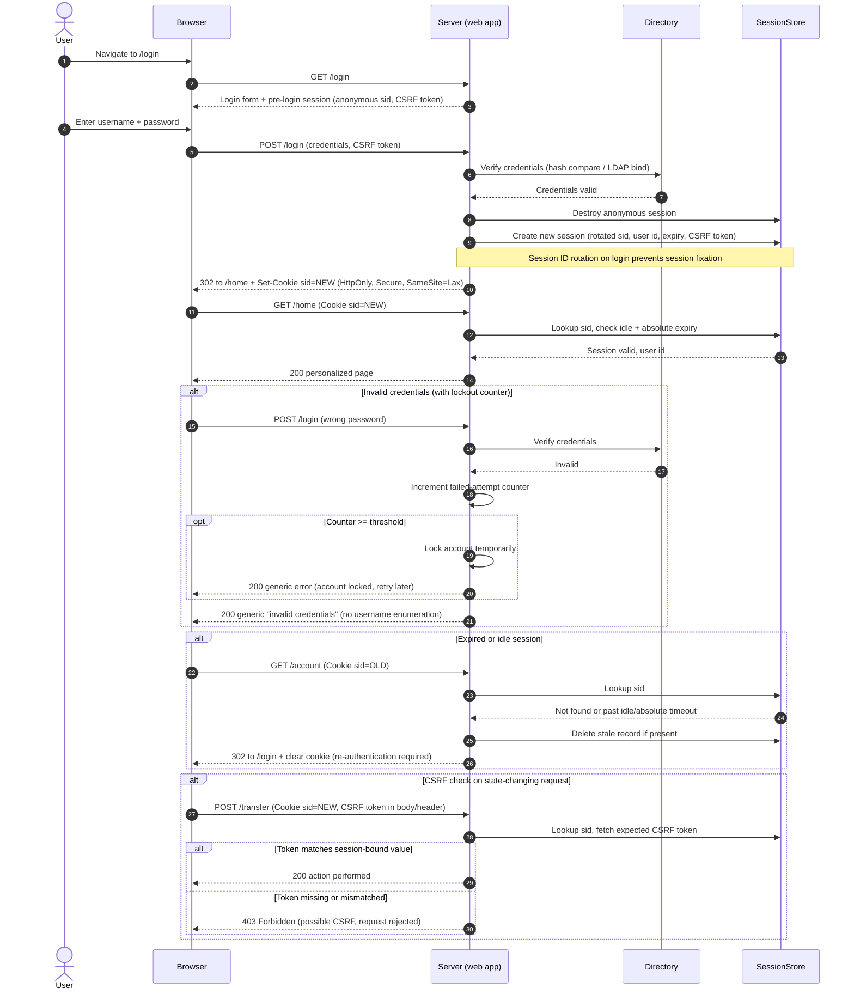

# Session Cookie Authentication — Sequence Diagram

Happy path: form login, session-ID rotation, authenticated request. Alternates:
invalid credentials with lockout, expired/idle session, CSRF check on a
state-changing request.

