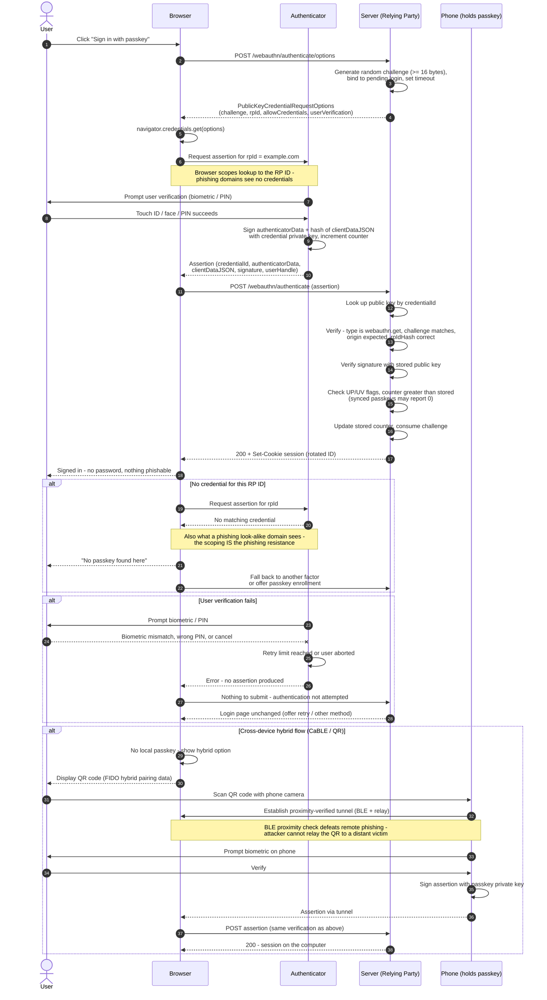

# WebAuthn / Passkey Authentication — Sequence Diagram

Happy path: challenge, `navigator.credentials.get()`, user verification, signed
assertion, server-side verification. Alternates: no credential for the RP ID,
user-verification failure, cross-device hybrid (QR/CaBLE) flow.

