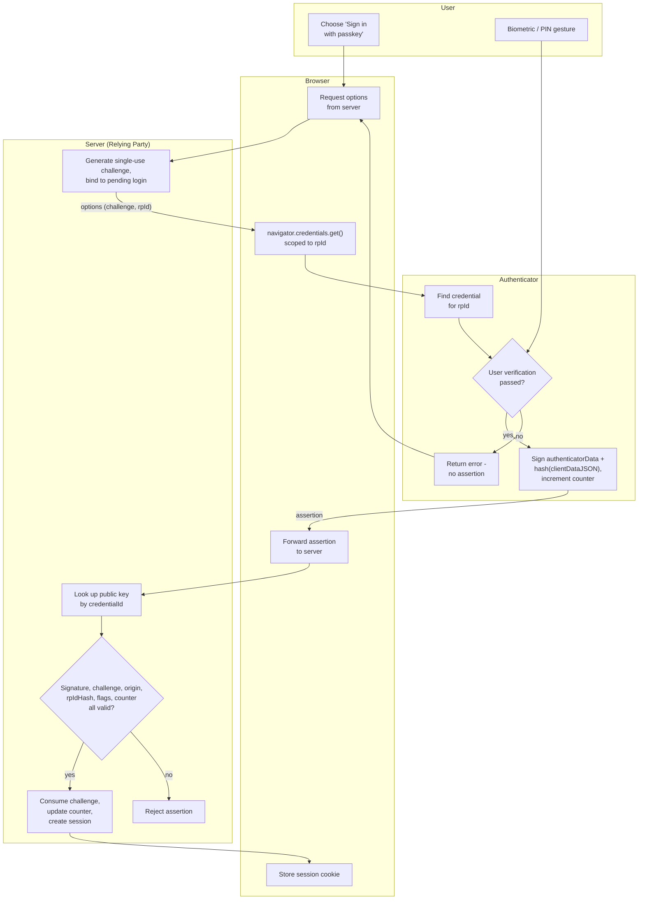

# WebAuthn / Passkey Authentication — Swimlane

```mermaid
flowchart TD
    subgraph User
        U1["Choose 'Sign in<br/>with passkey'"]
        U2["Biometric / PIN gesture"]
    end

    subgraph Browser
        B1["Request options<br/>from server"]
        B2["navigator.credentials.get()<br/>scoped to rpId"]
        B3["Forward assertion<br/>to server"]
        B4["Store session cookie"]
    end

    subgraph Authenticator
        A1["Find credential<br/>for rpId"]
        A2{"User verification<br/>passed?"}
        A3["Sign authenticatorData +<br/>hash(clientDataJSON),<br/>increment counter"]
        A4["Return error -<br/>no assertion"]
    end

    subgraph Server["Server (Relying Party)"]
        S1["Generate single-use challenge,<br/>bind to pending login"]
        S2["Look up public key<br/>by credentialId"]
        S3{"Signature, challenge, origin,<br/>rpIdHash, flags, counter<br/>all valid?"}
        S4["Consume challenge,<br/>update counter,<br/>create session"]
        S5["Reject assertion"]
    end

    U1 --> B1 --> S1
    S1 -->|"options (challenge, rpId)"| B2
    B2 --> A1 --> A2
    U2 --> A2
    A2 -->|yes| A3 -->|assertion| B3
    A2 -->|no| A4 --> B1
    B3 --> S2 --> S3
    S3 -->|yes| S4 --> B4
    S3 -->|no| S5
```
