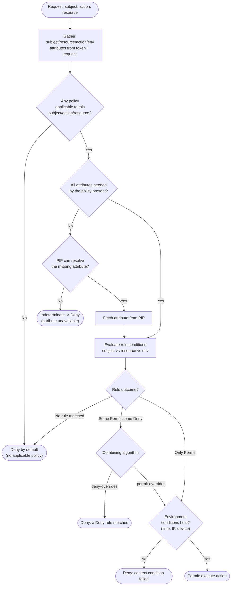

# ABAC — Decision Flowchart

Attribute gathering, policy matching, condition evaluation, and combining-algorithm resolution.
Deny and Indeterminate terminals are explicit.

Notes

- **Deny by default** is the backstop: a request that matches no policy is denied, never
  implicitly permitted.
- **Indeterminate** (missing attribute, PIP error) is mapped to Deny here — fail-closed. A
  permit-biased system would need an explicit, deliberate reason to do otherwise.
- The **combining algorithm** is the tie-breaker when Permit and Deny rules both match; deny-overrides
  is the conservative default and the one most standards recommend.
- Environment conditions are drawn last only for clarity; a real PDP evaluates them as part of the
  same rule expressions.
