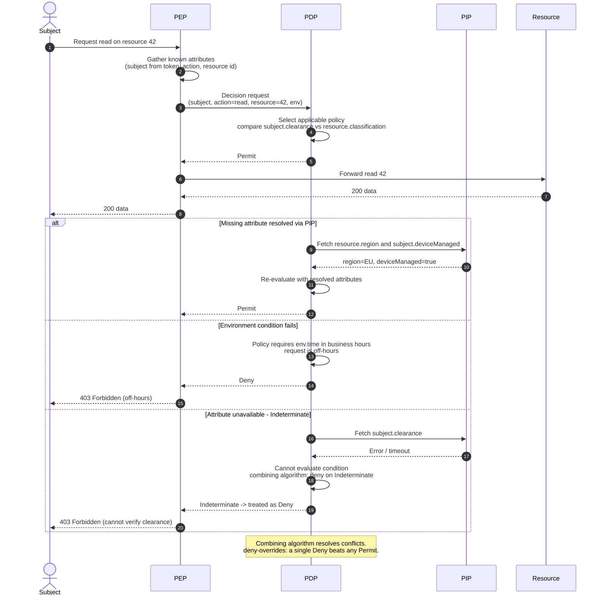

# ABAC — Sequence Diagram

Happy path first (all attributes present, policy permits), then alternates: an attribute fetched
from a PIP, an environment condition failing, and an Indeterminate result when a PIP is unavailable.

Notes

- The PEP hands the PDP whatever attributes it already trusts (typically subject claims from a
  validated token); the PDP pulls the rest from PIPs.
- **Indeterminate** is a first-class outcome distinct from Deny: the policy could not be evaluated.
  For sensitive resources the combining algorithm maps it to Deny (fail-closed).
- Every decision should be logged with the attribute values and the rule id that matched — see the
  decision logs in [pbac-policy-engine](../pbac-policy-engine/README.md).
