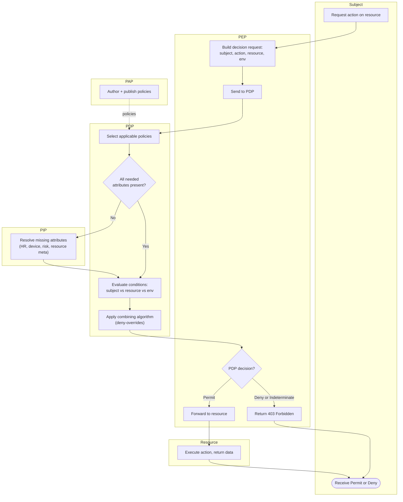

# ABAC — Swimlane Diagram

One lane per component. The PDP evaluates policy against attributes gathered from the request, the
PIPs, and the policies published by the PAP.

Notes

- The PAP lane feeds policies into the PDP out of band (dashed) — policy authoring is not on the
  request path.
- `D2 --> I1` is the PIP round trip; if the PIP errors, `D4` yields **Indeterminate**, which the
  combining algorithm maps to Deny for fail-closed resources.
- Compare with the [XACML swimlane](../xacml-pdp-pep/swimlane.md): same PEP/PDP/PIP/PAP roles,
  formalized as a standard.
