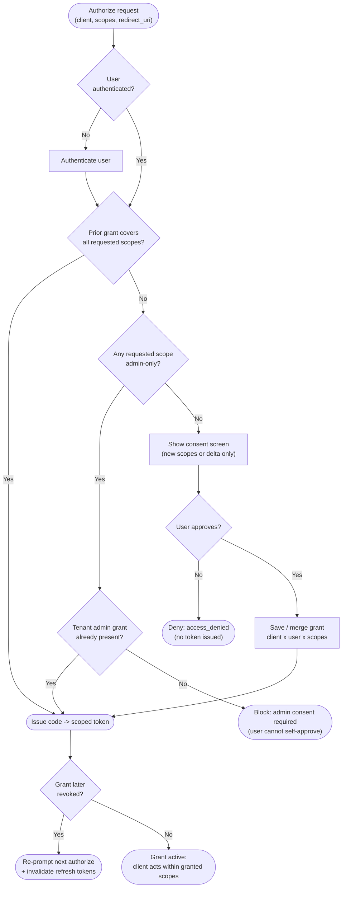

# OAuth Consent — Decision Flowchart

The consent decision from an authorization request to a scoped token or a refusal. Covers prior
grants, admin-only scopes, user approval/denial, incremental deltas, and revocation. Deny and
admin-required terminals are explicit.

Notes

- **Prior-grant check first**: an existing grant covering the requested scopes issues a token with no
  screen — consent is a per-scope-set decision, remembered until revoked.
- **Admin-only scopes cannot be self-consented**: the `NeedAdmin` terminal blocks the user and routes
  to a tenant-wide admin grant, which then satisfies `HasAdmin` for all users.
- **Incremental consent** enters at `Screen` with only the **delta** scopes and merges them into the
  existing grant (`SaveGrant`), so grants grow least-privilege rather than being broad up front.
- **Granted scopes are a ceiling, not per-object permission**: an active grant lets the client *ask*
  within scope; the resource still resolves fine-grained entitlement per request.
- **Revocation** forces a re-prompt and invalidates bound refresh tokens; short access-token
  lifetimes bound how long a revoked grant keeps working.
